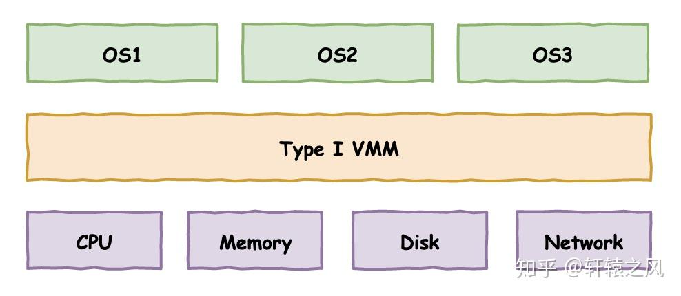
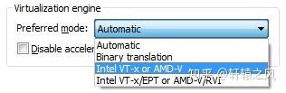
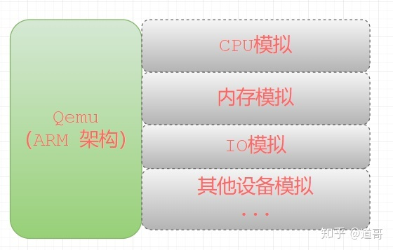

# 虚拟化技术
references:  
[懂了！VMware、KVM、Docker原来是这么回事儿](https://zhuanlan.zhihu.com/p/272202324)  
[深入理解虚拟化](https://zhuanlan.zhihu.com/p/441287815)


虚拟化管理程序Hypervisor（VMM，Virtual Machine Monitor），位于虚拟机与底层硬件
设备之间的虚拟层，直接运行于硬件设备之上，负责对硬件资源进行抽象，为上层虚拟机
提供运行环境所需资源，并使每个虚拟机都能够互不干扰、相互独立地运行于同一个系统中。




从图中可以清楚的看到两种虚拟化方案的区别：
* Type I: 直接凌驾于硬件之上，构建出多个隔离的操作系统环境
* Type II: 依赖于宿主操作系统，在其上构建出多个隔离的操作系统环境

我们熟知的VMware事实上有两个产品线，一个是VMware ESXi，直接安装在裸金属之上，不需要
额外的操作系统，属于第一类虚拟化。另一个是我们普通用户更加熟知的VMware WorkStation，
属于第二类虚拟化。


## 全虚拟化：VMware 二进制翻译技术

VMware和QEMU走出了两条不同的路。

VMware创造性的提出了一个二进制翻译技术。VMM在虚拟机操作系统和宿主计算机之间扮演
一个桥梁的角色，将虚拟机中的要执行的指令“翻译”成恰当的指令在宿主物理计算机上执行，
以此来模拟执行虚拟机中的程序。你可以简单理解成Java虚拟机执行Java字节码的过程，
不同的是Java虚拟机执行的是字节码，而VMM模拟执行的就是CPU指令。

另外值得一提的是，为了提高性能，也并非所有的指令都是模拟执行的，VMware在这里做了
不少的优化，对一些“安全”的指令，就让它直接执行也未尝不可。所以VMware的二进制翻译
技术也融合了部分的直接执行。

对于虚拟机中的操作系统，VMM需要完整模拟底层的硬件设备，包括处理器、内存、时钟、I/O
设备、中断等等，换句话说，VMM用纯软件的形式“模拟”出一台计算机供虚拟机中的操作系统使用。

这种完全模拟一台计算机的技术也称为全虚拟化，这样做的好处显而易见，虚拟机中的操作
系统感知不到自己是在虚拟机中，代码无需任何改动，直接可以安装。而缺点也是可以想象：
完全用软件模拟，转换翻译执行，性能堪忧！

而QEMU则是完全软件层面的“模拟”，乍一看和VMware好像差不多，不过实际本质是完全不同的。
VMware是将原始CPU指令序列翻译成经过处理后的CPU指令序列来执行。而QEMU则是完全模拟执行
整个CPU指令集，更像是“解释执行”，两者的性能不可同日而语。

## 半虚拟化：Xen 内核定制修改

既然有全虚拟化，那与之相对的也就有半虚拟化，前面说了，由于敏感指令的关系，全虚拟化的
VMM需要捕获到这些指令并完整模拟执行这个过程，实现既满足虚拟机操作系统的需要，又不至于
影响到物理计算机。

但说来简单，这个模拟过程实际上相当的复杂，涉及到大量底层技术，并且如此模拟费时费力。

而试想一下，如果把操作系统中所有执行敏感指令的地方都改掉，改成一个接口调用（HyperCall），
接口的提供方VMM实现对应处理，省去了捕获和模拟硬件流程等一大段工作，性能将获得大幅度提升。

这就是半虚拟化，这项技术的代表就是Xen，一个诞生于2003年的开源项目。

这项技术一个最大的问题是：需要修改操作系统源码，做相应的适配工作。这对于像Linux
这样的开源软件还能接受，充其量多了些工作量罢了。但对于Windows这样闭源的商业操作系统，
修改它的代码，无异于痴人说梦。

## 硬件辅助虚拟化 VT / AMD-v

折腾来折腾去，全都是因为x86架构的CPU天然不支持经典虚拟化模式，软件厂商不得不想出
其他各种办法来在x86上实现虚拟化。

如果进一步讲，CPU本身增加对虚拟化的支持，那又会是一番怎样的情况呢？

在软件厂商使出浑身解数来实现x86平台的虚拟化后的不久，各家处理器厂商也看到了虚拟化
技术的广阔市场，纷纷推出了硬件层面上的虚拟化支持，正式助推了虚拟化技术的迅猛发展。

这其中为代表的就是Intel的VT系列技术和AMD的AMD-v系列技术。

原先的VMM为了能够掌控虚拟机中代码的执行，不得已采用“中间人”来进行翻译执行，现在
新的CPU告诉VMM：不用那么麻烦了，你提前告诉我你对哪些指令哪些事件感兴趣，我在执行
这些指令和发生这些事件的时候就通知你，你就可以实现掌控了。完全由硬件层面提供支持，
性能自然高了不少。

VMware从5.5版本开始引入对硬件辅助虚拟化的支持，随后在2011年的8.0版本中正式全面支持。
于是乎，我们在创建虚拟机的时候，可以选择要使用哪一种虚拟化引擎技术，是用原先的二
进制翻译执行，还是基于硬件辅助虚拟化的新型技术。



## KVM-QEMU

有了硬件辅助虚拟化的加持，虚拟化技术开始呈现井喷之势。VirtualBox、Hyper-V、KVM等
技术如雨后春笋般接连面世。这其中在云计算领域声名鹊起的当属开源的KVM技术了。

KVM全称for Kernel-based Virtual Machine，意为基于内核的虚拟机。

在虚拟化底层技术上，KVM和VMware后续版本一样，都是基于硬件辅助虚拟化实现。不同的
是VMware作为独立的第三方软件可以安装在Linux、Windows、MacOS等多种不同的操作系统
之上，而KVM作为一项虚拟化技术已经集成到Linux内核之中，可以认为Linux内核本身就是
一个HyperVisor，这也是KVM名字的含义，因此该技术只能在Linux服务器上使用。


KVM技术常常搭配QEMU一起使用，称为KVM-QEMU架构。前面提到，在x86架构CPU的硬件辅助
虚拟化技术诞生之前，QEMU就已经采用全套软件模拟的办法来实现虚拟化，只不过这种方案
下的执行性能非常低下。

KVM本身基于硬件辅助虚拟化，仅仅实现CPU和内存的虚拟化，但一台计算机不仅仅有CPU和
内存，还需要各种各样的I/O设备，不过KVM不负责这些。这个时候，QEMU就和KVM搭上了线，
经过改造后的QEMU，负责外部设备的虚拟，KVM负责底层执行引擎和内存的虚拟，两者彼此
互补，成为新一代云计算虚拟化方案的宠儿。

## 容器技术-LXC & Docker

前面谈到的无论是基于翻译和模拟的全虚拟化技术、半虚拟化技术，还是有了CPU硬件加持
下的全虚拟化技术，其虚拟化的目标都是一台完整的计算机，拥有底层的物理硬件、操作系统
和应用程序执行的完整环境。

为了让虚拟机中的程序实现像在真实物理机器上运行“近似”的效果，背后的HyperVisor做了
大量的工作，付出了“沉重”的代价。但是虚拟机中的程序只是想要一个单独的执行执行环境，
不需要你费那么大劲去虚拟出一个完整的计算机来。近几年大火的容器技术正是在这样的指导
思想下诞生的。


不同于虚拟化技术要完整虚拟化一台计算机，容器技术更像是操作系统层面的虚拟化，它只
需要虚拟出一个操作系统环境。

LXC技术就是这种方案的一个典型代表，全称是LinuX Container，通过Linux内核的Cgroups技术
和namespace技术的支撑，隔离操作系统文件、网络等资源，在原生操作系统上隔离出一个单独的
空间，将应用程序置于其中运行，这个空间的形态上类似于一个容器将应用程序包含在其中，故
取名容器技术。

如今各个大厂火爆的Docker技术底层原理与LXC并无本质区别，甚至在早期Docker就是直接
基于LXC的高层次封装。Docker在LXC的基础上更进一步，将执行执行环境中的各个组件和
依赖打包封装成独立的对象，更便于移植和部署。

容器技术的好处是轻量，所有隔离空间的程序代码指令不需要翻译转换，就可以直接在CPU上
执行，大家底层都是同一个操作系统，通过软件层面上的逻辑隔离形成一个个单独的空间。

容器技术的缺点是安全性不如虚拟化技术高，毕竟软件层面的隔离比起硬件层面的隔离要弱
得多。隔离环境系统和外面的主机共用的是同一个操作系统内核，一旦利用内核漏洞发起
攻击，程序突破容器限制，实现逃逸，危及宿主计算机，安全也就不复存在。

## 超轻虚拟化 firecracker

虚拟完整的计算机隔离性好但太过笨重，简单的容器技术又因为太过轻量纯粹靠软件隔离不
够安全，有没有一个折中的方案同时兼具两者的优点，实现既轻量又安全呢？

近年来，一种超轻虚拟化的思想开始流行开来，亚马逊推出的firecracker就是一个典型的代表。

firecracker将虚拟化技术的强隔离性和容器技术的轻量性进行融合，提出了一个microVM的
概念，底层通过KVM虚拟化技术实现各个microVM的强隔离，而隔离的虚拟机中运行的是一个个
精简版的微型操作系统，砍掉了大量无用的功能，专为容器设计的微型OS。

超轻虚拟化如今成为一个新的浪潮，除了AWS的firecracker，谷歌的gVisor, Intel主导的NEMU
也在向这个领域开始发力。

# QEMU

references:  
[Welcome to QEMU’s documentation!](https://qemu-project.gitlab.io/qemu/index.html)  
[Standard options](https://www.qemu.org/docs/master/system/invocation.html)  
[一步步教你：如何用Qemu来模拟ARM系统](https://zhuanlan.zhihu.com/p/340362172)  

## 为什么需要QEMU模拟

ARM平台的软件开发工作，可以划分为2类：
* 应用程序的开发
* 系统开发(内核、文件系统、驱动程序)

以上这两种分类，主要是从开发工作的内容角度来进行划分的。可以看出：
* 应用程序开发：灵活性更大、需求变动会更多(产品经理或项目经理经常给你改需求)。
* 系统软件开发：需求更稳定、很多代码都是官方提供或者开源的，工作内容就是进行定制、裁剪。

系统开发的最终目的是：为应用程序的执行准备一个基本的执行环境，内容包括：系统引导
程序bootloader，内核kernel，文件系统rootfs，系统中所有设备的驱动程序。在实际的项目
开发中，系统开发难度更大一些，一旦开发完成，对于一块板子来说基本上不会轻易变动，
代码的使用生命周期更长。

对于系统软件开发来说，如果每次编译出一个bootloader、或者kernel，都上一个ARM开发板
进行验证，的确比较麻烦。如果能有一个ARM模拟系统，直接在x86上进行模拟，工作效率就会
提高很多。


因为Qemu是使用纯软件模拟的，它的强项是模拟那些不涉及到外部的具体硬件设备的场景，比如：
* 想学习如何定制bootloader；
* 想在Arm系统中进行文件系统的裁剪，学习文件系统的挂载过程;
* 想体验一下如何配置、裁剪linux kernel； 想学习Linux系统中的设备树；
* ...

以上这些场景中，都非常适合使用Qemu来模拟ARM系统。

## 工作原理

Qemu是一个开源的托管虚拟机，通过纯软件来实现虚拟化模拟器，几乎可以模拟任何硬件设备。
比如：Qemu可以模拟出一个ARM系统中的：CPU、内存、IO设备等，然后在这个模拟层之上，可以
跑一台ARM虚拟机，这个ARM虚拟机认为自己在和硬件进行打交道，但实际上这些硬件都是Qemu
模拟出来的。



正因为Qemu是纯软件实现的，所有的指令都要经过它的转换，所以性能非常低。所以在生产
环境中，大多数的做法都是配合KVM来完成虚拟化工作，因为KVM是硬件辅助的虚拟化技术，
主要负责比较繁琐的CPU和内存虚拟化，而Qemu则负责I/O虚拟化，两者合作各自发挥自身的
优势，相得益彰。这部分不是重点，就不具体深入介绍了。

## Qemu的两种工作模式

Qemu有两种执行模式：

**用户模式(User mode)：**

利用动态代码翻译机制来执行不同主机架构的代码，例如：在x86平台上模拟执行ARM代码，
也就是说：我们写一条ARM指令，传入整个模拟器中，模拟器会把整个指令翻译成x86平台的
指令，然后在x86的CPU中执行。


**系统模式(System mode)：**

模拟整个电脑系统，利用其它VMM(Xen, KVM)来使用硬件提供的虚拟化支持，创建接近于主机
性能的全功能虚拟机。


## 常用指令

references:  
[Ubuntu 上的 QEMU 入门 – 图解指南](https://raspberrytips.com/qemu-on-ubuntu/)  
[Getting started with qemu](https://drewdevault.com/2018/09/10/Getting-started-with-qemu.html)  
[qemu常用参数选项说明](https://huaweicloud.csdn.net/63561a60d3efff3090b5a4fd.html?spm=1001.2101.3001.6661.1&utm_medium=distribute.pc_relevant_t0.none-task-blog-2%7Edefault%7EBlogCommendFromBaidu%7Eactivity-1-123250595-blog-98049618.235%5Ev38%5Epc_relevant_sort_base3&depth_1-utm_source=distribute.pc_relevant_t0.none-task-blog-2%7Edefault%7EBlogCommendFromBaidu%7Eactivity-1-123250595-blog-98049618.235%5Ev38%5Epc_relevant_sort_base3&utm_relevant_index=1)


### 基本步骤

**安装 QEMU 后，以下是使用 QEMU 创建新虚拟机的基本步骤：**
* 下载要使用的操作系统的映像
* 创建一个新的虚拟磁盘，用于安装系统
* 启动 QEMU，指定虚拟磁盘和映像文件

**下载要使用的操作系统的映像**

可以是Linux的发布版本，这里选择 debian 和 alpine

https://cdimage.debian.org/debian-cd/current/arm64/iso-cd/debian-12.1.0-arm64-netinst.iso

https://cdimage.debian.org/debian-cd/current/i386/iso-cd/debian-12.1.0-i386-netinst.iso

https://nl.alpinelinux.org/alpine/v3.8/releases/x86_64/alpine-standard-3.8.0-x86_64.iso

**创建虚拟磁盘**
为 QEMU 创建虚拟磁盘的基本命令是 qemu-img。语法如下：
```
qemu-img create <filename.format> <size>

ex: qemu-img create myvm.qcow2 16G
```

QEMU 支持不同格式的虚拟磁盘：
* qcow2：QEMU 的本机格式。
* vdi：VirtualBox 磁盘。
* vmdk：VmWare 磁盘。
* vhdx：Hyper-v 虚拟磁盘。
* 您可以在[此处](https://qemu-project.gitlab.io/qemu/system/images.html)找到完整列表。

**启动QEMU**
```shell
# ==> ex1:
qemu-img create myvm.qcow2 16G
qemu-system-i386 -boot d -cdrom ./debian-12.1.0-i386-netinst.iso -m 4096 -hda ./myvm.qcow2

# ==> ex2:
curl -O https://nl.alpinelinux.org/alpine/v3.8/releases/x86_64/alpine-standard-3.8.0-x86_64.iso
qemu-img create -f qcow2 alpine.qcow2 16G
qemu-system-x86_64 \
    -enable-kvm \
    -m 4096 \
    -drive file=alpine.qcow2,media=disk,if=virtio \
    -nic user,model=virtio \
    -cdrom alpine-standard-3.8.0-x86_64.iso

# ==> ex3:
# reference: https://futurewei-cloud.github.io/ARM-Datacenter/qemu/how-to-launch-aarch64-vm/
# Create the flash images with the correct sizes.
dd if=/dev/zero of=flash1.img bs=1M count=64
dd if=/dev/zero of=flash0.img bs=1M count=64
dd if=/usr/share/qemu-efi-aarch64/QEMU_EFI.fd of=flash0.img conv=notrunc

# Download the image you want to boot.
# For our example we use an Ubuntu installer.
wget http://ports.ubuntu.com/ubuntu-ports/dists/bionic-updates/main/installer-arm64/current/images/netboot/mini.iso

# Create the empty Ubuntu image file we will install Ubuntu into.
# We will use 20 gigabytes for this file.
qemu-img create ubuntu-image.img 20G

# Start QEMU with the installer.
qemu-system-aarch64 -nographic -machine virt,gic-version=max -m 4096M -cpu max -smp 4 \
-netdev user,id=vnet,hostfwd=:127.0.0.1:0-:22 -device virtio-net-pci,netdev=vnet \
-drive file=ubuntu-image.img,if=none,id=drive0,cache=writeback -device virtio-blk,drive=drive0,bootindex=0 \
-drive file=mini.iso,if=none,id=drive1,cache=writeback -device virtio-blk,drive=drive1,bootindex=1 \
-drive file=flash0.img,format=raw,if=pflash -drive file=flash1.img,format=raw,if=pflash

# Follow the instructions to install Ubuntu to the ubuntu-image.img file.
# Once the install is finished you can exit QEMU with -a x.
# Then restart QEMU without the installer image with the following command.
qemu-system-aarch64 -nographic -machine virt,gic-version=max -m 4096M -cpu max -smp 4 \
-netdev user,id=vnet,hostfwd=:127.0.0.1:0-:22 -device virtio-net-pci,netdev=vnet \
-drive file=ubuntu-image.img,if=none,id=drive0,cache=writeback -device virtio-blk,drive=drive0,bootindex=0 \
-drive file=flash0.img,format=raw,if=pflash -drive file=flash1.img,format=raw,if=pflash


# ==> ex4:
# reference: https://wiki.debian.org/QEMU

# install qemu
sudo apt install qemu-utils qemu-system-x86 qemu-system-gui

# create the hard disk image
# qemu-img create debian.img 20G
# or use qcow format( QEMUs own "Copy On Write" image format):
qemu-img create -f qcow2 debian.qcow 20G

# Download a current boot image, e.g. the businesscard image at
# http://cdimage.debian.org/cdimage/daily-builds/daily/arch-latest/amd64/iso-cd/
# Here we use the normal x86 system image, ex: debian or ubuntu.
wget  https://cdimage.debian.org/cdimage/daily-builds/daily/arch-latest/amd64/iso-cd/debian-testing-amd64-netinst.iso

# Boot the image with:
qemu-system-x86_64 -hda debian.qcow -cdrom debian-testing-amd64-netinst.iso -boot d -m 4096
# If you have KVM, you can use it by including the option -enable-kvm.

# After the installation is done, the system can be booted with:
qemu-system-x86_64 -hda debian.qcow -m 4096
```
* qemu-system-x86_64：运行具有 64 位架构的经典虚拟机的基本命令
* -boot：指定从哪里启动，a、b（软盘 1 和 2）、c（第一个硬盘）、d（第一个 CD-ROM）、
         np（从网络适配器 1-4 进行 Etherboot），默认为硬盘启动
* -cdrom：映像文件的位置（可能是 /home/user/Downloads/yourimage.iso）
* -m：该虚拟机所需的 RAM 空间大小
* -hda：刚刚创建的虚拟磁盘的路径（myvm.qcow2）
* -sdl：指定图形配置，使用 SDL 后端，这是最简单的可用图形后端

### qemu-img

reference:  
[QEMU disk image utility](https://www.qemu.org/docs/master/tools/qemu-img.html)

`qemu-img [standard options] command [command options]`

qemu-img 允许创建、转换和修改镜像。它可以处理 QEMU 支持的所有镜像格式。

#### 标准选项

`-h, --help`

显示此帮助并退出

`-V, --version`

显示版本信息并退出

`-T, --trace [[enable=]PATTERN][,events=FILE][,file=FILE]`

指定跟踪选项。

* [enable=]PATTERN  
  立即启用与PATTERN （事件名称或通配模式）匹配的事件。仅当 QEMU 已使用simple,log 或
  ftrace跟踪后端进行编译时，此选项才可用。要指定多个事件或模式，请-trace多次指定该选项。  
  用于打印跟踪点名称列表。-trace help

* events=FILE  
  立即启用FILE中列出的事件。文件的trace-events-all 每一行必须包含一个事件名称
  （如文件中所列）；通配模式也被接受。仅当 QEMU 已使用simple,log或 ftrace跟踪后端
  进行编译时，此选项才可用。

* file=FILE  
  将输出跟踪记录到FILE。仅当 QEMU 已使用simple跟踪后端进行编译时，此选项才可用。


#### 命令

支持以下命令：

* `amend [--object OBJECTDEF] [--image-opts] [-p] [-q] [-f FMT] [-t CACHE] [--force] -o OPTIONS FILENAME`

* `bench [-c COUNT] [-d DEPTH] [-f FMT] [--flush-interval=FLUSH_INTERVAL] [-i AIO] [-n] [--no-drain] [-o OFFSET] [--pattern=PATTERN] [-q] [-s BUFFER_SIZE] [-S STEP_SIZE] [-t CACHE] [-w] [-U] FILENAME`

* `bitmap (--merge SOURCE | --add | --remove | --clear | --enable | --disable)... [-b SOURCE_FILE [-F SOURCE_FMT]] [-g GRANULARITY] [--object OBJECTDEF] [--image-opts | -f FMT] FILENAME BITMAP`

* `check [--object OBJECTDEF] [--image-opts] [-q] [-f FMT] [--output=OFMT] [-r [leaks | all]] [-T SRC_CACHE] [-U] FILENAME`

* `commit [--object OBJECTDEF] [--image-opts] [-q] [-f FMT] [-t CACHE] [-b BASE] [-r RATE_LIMIT] [-d] [-p] FILENAME`

* `compare [--object OBJECTDEF] [--image-opts] [-f FMT] [-F FMT] [-T SRC_CACHE] [-p] [-q] [-s] [-U] FILENAME1 FILENAME2`

* `convert [--object OBJECTDEF] [--image-opts] [--target-image-opts] [--target-is-zero] [--bitmaps] [-U] [-C] [-c] [-p] [-q] [-n] [-f FMT] [-t CACHE] [-T SRC_CACHE] [-O OUTPUT_FMT] [-B BACKING_FILE [-F BACKING_FMT]] [-o OPTIONS] [-l SNAPSHOT_PARAM] [-S SPARSE_SIZE] [-r RATE_LIMIT] [-m NUM_COROUTINES] [-W] [--salvage] FILENAME [FILENAME2 [...]] OUTPUT_FILENAME`

* `create [--object OBJECTDEF] [-q] [-f FMT] [-b BACKING_FILE [-F BACKING_FMT]] [-u] [-o OPTIONS] FILENAME [SIZE]`

* `dd [--image-opts] [-U] [-f FMT] [-O OUTPUT_FMT] [bs=BLOCK_SIZE] [count=BLOCKS] [skip=BLOCKS] if=INPUT of=OUTPUT`

* `info [--object OBJECTDEF] [--image-opts] [-f FMT] [--output=OFMT] [--backing-chain] [-U] FILENAME`

* `map [--object OBJECTDEF] [--image-opts] [-f FMT] [--start-offset=OFFSET] [--max-length=LEN] [--output=OFMT] [-U] FILENAME`

* `measure [--output=OFMT] [-O OUTPUT_FMT] [-o OPTIONS] [--size N | [--object OBJECTDEF] [--image-opts] [-f FMT] [-l SNAPSHOT_PARAM] FILENAME]`

* `snapshot [--object OBJECTDEF] [--image-opts] [-U] [-q] [-l | -a SNAPSHOT | -c SNAPSHOT | -d SNAPSHOT] FILENAME`

* `rebase [--object OBJECTDEF] [--image-opts] [-U] [-q] [-f FMT] [-t CACHE] [-T SRC_CACHE] [-p] [-u] -b BACKING_FILE [-F BACKING_FMT] FILENAME`

* `resize [--object OBJECTDEF] [--image-opts] [-f FMT] [--preallocation=PREALLOC] [-q] [--shrink] FILENAME [+ | -]SIZE`

#### 命令选项

`FILENAME`是磁盘映像文件名。

`FMT`是磁盘映像格式。在大多数情况下，它是自动猜测的。有关支持的磁盘格式的说明，请参阅下文。

`SIZE`是磁盘映像大小（以字节为单位）。支持 可选后缀k或 K（千字节，1024）M（兆字节，1024k）和（千兆字节，1024M）和T（太字节，1024G）。被忽略。Gb

`OUTPUT_FILENAME`是目标磁盘映像文件名。

`OUTPUT_FMT`是目标格式。

`OPTIONS`是格式特定选项的逗号分隔列表，采用名称=值格式。用于查看所用格式支持的选项的概述，
或参阅下面的格式说明了解详细信息。-o help

`SNAPSHOT_PARAM`是用于内部快照的参数，格式为 `'snapshot.id=[ID],snapshot.name=[NAME]'` 或 `'[ID_OR_NAME]'`。


#### 支持的图像文件格式

##### raw

原始磁盘映像格式（默认）。这种格式的优点是简单并且可以轻松导出到所有其他模拟器。
如果您的文件系统支持漏洞（例如 Linux 上的 ext2 或 ext3 或 Windows 上的 NTFS），
则只有写入的扇区才会保留空间。使用`qemu-img info` 或`ls -ls`了解图像或Unix/Linux 
上使用的实际大小。

支持的选项：

* `preallocation`

预分配模式（允许值：off、falloc、 full）。 falloc模式通过调用 posix_fallocate()
为图像预分配空间。 full模式通过将数据写入底层存储来为图像预分配空间。该数据可能
为零也可能不为零，具体取决于存储位置。

##### qcow2

QEMU 图像格式，最通用的格式。使用它来获得更小的映像（如果您的文件系统不支持漏洞，
例如在 Windows 上）、可选的 AES 加密、基于 zlib 或 zstd 的压缩以及对多个 VM 快照的
支持，则非常有用。

支持的选项：
* `compat`


确定要使用的 qcow2 版本。compat=0.10使用自 0.10 起任何 QEMU 都可以读取的传统图像格式。
compat=1.1启用只有 QEMU 1.1 及更高版本才能理解的图像格式扩展（这是默认设置）。其中
包括零簇，它允许对稀疏图像进行高效的读时复制。

* `backing_file`

基础映像的文件名（请参阅create子命令）

* `backing_fmt`

基础镜像的镜像格式

* `compression_type`

此选项配置将使用哪种压缩算法来压缩图像上的簇。请注意，设置此选项还不会导致映像实际
接收压缩写入。它最常与-c选项一起使用，但也可以与启用压缩的过滤器驱动程序或备份块
作业一起使用。qemu-img convertcompress

有效值为zlib和zstd。对于使用 的图像 compat=0.10，仅zlib可以使用压缩。

* `encryption`

如果此选项设置为on，则使用 128 位 AES-CBC 加密图像。

现代密码学标准认为 qcow 和 qcow2 图像中加密的使用存在缺陷，存在许多设计问题：

AES-CBC 密码与基于扇区号的可预测初始化向量一起使用。这使得它容易受到选择性明文攻击
的影响，这种攻击可以揭示加密数据的存在。

用户密码直接用作加密密钥。选择不当或较短的密码将会损害加密的安全性。

如果密码被泄露，则无法更改密码来保护任何 qcow 映像中的数据。必须在新文件中使用不同
的加密密码来克隆文件。然后必须使用 shred 等程序安全地擦除原始文件，尽管这对于许多
现代存储技术来说是无效的。

用于加密扇区的初始化向量基于客户虚拟扇区号，而不是主机物理扇区。当磁盘映像具有多个
内部快照时，这意味着多个物理扇区中的数据使用相同的初始化向量进行加密。使用 CBC 模式，
如果攻击可以收集使用相同 IV 和一些可预测数据加密的多个扇区，则这将带来水印攻击的
可能性。多个 qcow2 镜像具有相同的密码也暴露了这个弱点，因为密码直接用作密钥。

因此强烈建议不要使用 qcow / qcow2 加密。建议用户使用替代加密技术，例如Linux dm-crypt / LUKS系统。

* `cluster_size`

更改 qcow2 簇大小（必须在 512 到 2M 之间）。较小的簇大小可以改善图像文件大小，
而较大的簇大小通常可以提供更好的性能。

* `preallocation`

预分配模式（允许值：off、metadata、 falloc、full）。具有预分配元数据的映像最初较大，
但当映像需要增长时可以提高性能。falloc和full预分配类似于相同的raw格式选项，但也设置
元数据。

* `lazy_refcounts`

如果此选项设置为on，则会推迟引用计数更新，以避免元数据 I/O 并提高性能。这是特别
有趣的， cache=writethrough它不会批量更新元数据。权衡是，主机崩溃后，必须重建引用
计数表，即在下次打开时 需要（自动），这可能需要一些时间。qemu-img check -r all

compat=1.1仅当指定时才能启用此选项。

* `nocow`

如果该选项设置为on，则会关闭文件的 COW。仅对btrfs有效，对其他文件系统没有影响。

托管 VM 映像文件时，Btrfs 的性能较低，当 VM 上的来宾也使用 btrfs 作为文件系统时，
性能更差。关闭 COW 是缓解这种不良性能的一种方法。一般来说，关闭 btrfs 上的 COW 有
两种方法：

通过用 nodatacow 挂载来禁用它，那么所有新创建的文件都将是 NOCOW

对于空文件，添加 NOCOW 文件属性。这就是这个选项的作用。

注意：此选项仅对新文件或空文件有效。如果存在一个COW文件并且已经有数据块，则无法
通过设置将其更改为NOCOW nocow=on。可以发出命令来检查 NOCOW 标志是否已设置（大写“C”
是 NOCOW 标志）。lsattr filename

* `data_file`

将存储所有访客数据的文件名。如果使用此选项，qcow2 文件将仅包含图像的元数据。

注意：如果使用此选项时给定的文件名已存在，则会发生数据丢失，因为将重新创建数据文件，
覆盖文件的原始内容。要简单地将引用更新为指向给定的预先存在的文件，请使用
.qemu-img createqemu-imgqemu-img amend

* `data_file_raw`

如果此选项设置为on，QEMU 将始终保持外部数据文件作为独立的只读原始映像一致。

它通过将对 qcow2 文件的所有写访问转发到原始数据文件（包括它们的偏移量）来实现此目的。
因此，在 qcow2 节点（即对客户机）上某个偏移处可见的数据在原始数据文件中的相同偏移处
也是可见的。这会产生只读原始图像。绕过 qcow2 元数据的写入可能会损坏 qcow2 元数据，
因为带外写入可能会导致元数据与原始图像不同步。

如果该选项为off，QEMU 将使用数据文件以任意方式存储数据。如果没有随附的 qcow2 元数据，
该文件的内容将毫无意义。数据写入的位置与其客户端看到的偏移量无关，并且某些写入（特别
是零写入）可能根本不会转发到数据文件，而只能通过修改 qcow2 元数据来处理。

data_file仅当设置后才能启用此选项。


##### Other

QEMU 还支持各种其他映像文件格式，以便与旧版 QEMU 或其他虚拟机管理程序兼容，包括 VMDK、
VDI、VHD (vpc)、VHDX、qcow1 和 QED。有关支持格式的完整列表，请参阅`qemu-img --help`。
有关这些格式的更详细说明，请参阅 QEMU 块驱动程序参考文档。

这些格式的块驱动程序的主要目的是图像转换。对于正在运行的虚拟机，建议将磁盘映像转换
为 raw 或 qcow2，以获得良好的性能。


### 指令梳理

#### 标准选项

**-machine/-M**

`-machine [type=]name[,prop=value[,...]]`

按名称选择模拟计算机。用于列出可用的机器。-machine help

```
qemu-system-arm -M help
equal to:
qemu-system-arm -machine help
```

模拟器运行时必须选择一个具体的设备，比如运行树梅派3B则执行`qemu-system-aarch64 
-machine raspi3b`或`qemu-system-aarch64 -M raspi3b`，运行Quard Star board则是
执行`qemu-system-riscv64 -machine quard-star`或`qemu-system-aarch64 -M quard-star`。
qemu定义使用virt来进行通用模拟而非实际的某SOC。

具体到设备本身可能还有额外的参数作为可选项供使用者配置，要查看设备的可选参数可以
使用-machine ‘id’,help，例如：`qemu-system-riscv64 -machine quard-star,help`

**--cpu**

`-cpu model`

选择CPU型号（用于列表和附加功能选择）-cpu help

`qemu-system-aarch64 -M virt -cpu help`

**--boot**

`-boot [order=drives][,once=drives][,menu=on|off][,splash=sp_name][,splash-time=
sp_time][,reboot-timeout=rb_timeout][,strict=on|off]`

将引导顺序驱动器指定为驱动器字母字符串。有效的驱动器号取决于目标体系结构。

x86 PC 使用：a、b（软盘 1 和 2）、c（第一个硬盘）、d（第一个 CD-ROM）、np（从网络
适配器 1-4 进行 Etherboot），默认为硬盘启动。

要仅在第一次启动时应用特定的启动顺序，请通过 once 指定它。请注意，order或once参数
不应与bootindex设备属性一起使用，因为固件实现通常不会同时支持两者。

menu=on只要固件/BIOS 支持，就可以启用交互式启动菜单/提示。默认为非交互式启动。

如果固件/BIOS 支持，则当给出选项splash=sp_name 且menu=on 时，可以将启动图片传递到BIOS，
使用户能够将其显示为徽标。目前X86系统的Seabios支持它。 限制：启动画面文件可以是jpeg
文件或24 BPP 格式（真彩色）的BMP 文件。分辨率应为SVGA模式支持，因此推荐为320x240、
640x480、800x640。

可以将超时传递给 BIOS，当启动失败时，客户机将暂停 rb_timeout 毫秒，然后重新启动。
如果 rb_timeout 为“-1”，guest 将不会重新启动，qemu 默认将“-1”传递给 BIOS。目前X86
系统的Seabios支持它。

strict=on只要固件/BIOS 支持，就进行严格的启动。这仅在通过 bootindex 选项更改引导
优先级时有效。默认为非严格启动。

**-m**

`-m [size=]megs[,slots=n,maxmem=size]`

帮助说明：`qemu-system-x86_64 -m help`

将来虚拟机 RAM 大小设置为 megs 兆字节。默认值为 128 MiB。可选地，后缀“M”或“G”可用于分别表示以兆字节或千兆字节为单位的值。可选的对插槽，
maxmem 可用于设置热插拔内存插槽的数量和最大内存量。请注意，maxmem 必须与页面大小对齐。

例如，以下命令行将客户机启动 RAM 大小设置为 1GB，创建 3 个插槽来热插拔额外内存，
并将客户机可以达到的最大内存设置为 4GB：

`qemu-system-x86_64 -m 1G,slots=3,maxmem=4G`

如果未指定 slot 和 maxmem，则不会启用内存热插拔，并且客户机启动 RAM 将永远不会增加。

**-smp**

`-smp [[cpus=]n][,maxcpus=maxcpus][,sockets=sockets][,dies=dies][,clusters=clusters][,cores=cores][,threads=threads]`

现代cpu往往是对称多核心的，因此通过`-smp <num>`可以指定虚拟机核心数。

**-k**

`-k language`

使用键盘布局语言（例如fr法语）。仅当不易获取原始 PC 密钥代码时才需要此选项（例如，
在 Mac 上，使用某些 X11 服务器或使用 VNC 或 Curses 显示）。您通常不需要在 PC/Linux
或 PC/Windows 主机上使用它。

可用的布局有：
```
ar  de-ch  es  fo     fr-ca  hu  ja  mk     no  pt-br  sv
da  en-gb  et  fr     fr-ch  is  lt  nl     pl  ru     th
de  en-us  fi  fr-be  hr     it  lv  nl-be  pt  sl     tr
```
默认为en-us.

**-name**

`-name name`

设置来宾的姓名。该名称将显示在 SDL 窗口标题中。该名称也将用于 VNC 服务器。还可以
选择设置 Linux 中顶部可见的进程名称。Linux 上还可以启用单个线程的命名以帮助调试。

**-uuid**

`-uuid uuid`

设置系统UUID


#### 块设备选项

**-fd[a/b]**

```
-fda file
-fdb file
```

使用文件作为软盘 0/1 映像（请参阅《系统仿真用户指南》中的
“[磁盘映像](https://www.qemu.org/docs/master/system/images.html#disk-images)”一章）。

**-hd[a/b/c/d]**

```
-hda file
-hdb file
-hdc file
-hdd file
```

使用文件作为模拟计算机默认总线上的硬盘 0、1、2 或 3 映像（例如，大多数 x86 计算机
上的 IDE 总线，但也可以是其他目标架构上的 SCSI、virtio 或其他总线） 。另请参阅
《系统仿真用户指南》中的“[磁盘映像](https://www.qemu.org/docs/master/system/images.html#disk-images)”一章。

**-cdrom**

`-cdrom file`

在模拟机的默认总线上使用文件作为 CD-ROM 映像（这是 x86 上的 IDE1 master，因此您
不能 同时使用-hdc和）。-cdrom在支持它的系统上，您可以通过使用 as 文件名来使用主机
CD-ROM /dev/cdrom。

**-drive**

`-drive option[,option[,option[,...]]]`

定义一个新的驱动器。这包括创建块驱动程序节点（后端）以及来宾设备，该选项主要是定义
-blockdev 和 -device 操作相应的快捷方式。

-fda(-fdb)是软盘；-hda (-hdb –hdc -hdd)是硬盘；-cdrom 是光盘。这些可以使用 –drive
命令待代替。

-drive接受 接受的所有选项-blockdev。此外，它还知道以下选项：
* `file=<file>`  
此选项定义与该驱动器一起使用的镜像文件（请参阅《系统仿真用户指南》中的“磁盘映像”
章节）。如果文件名包含逗号，则必须将其加倍（例如，“file=my,,file”以使用文件“my,file”）。  
也可以使用特定于协议的 URL 来指定特殊文件（例如 iSCSI 设备）。有关详细信息，请
参阅“设备 URL 语法”部分。

* `if=<interface>`  
此选项定义驱动器连接的接口类型。可用类型有：ide, scsi, sd, mtd, floppy(软盘), 
pflash, virtio, none 。

* `bus=<bus>,unit=<unit>`  
通过定义总线编号和单元 ID 来定义驱动器的连接位置。

* `index=<index>`  
此选项通过使用 给定接口类型的，可用连接器列表中的，索引，来定义驱动器的连接位置。
（可能为盘符）

* `media=<media>`  
该选项定义媒体的类型：disk 或 cdrom。

* `snapshot=<snapshot>`  
值为“on”或“off”，并控制给定驱动器的快照模式（请参阅-snapshot）。

* `cache=<cache>`  
值为"none","writeback", or "writethrough" ，控制主机缓存用于访问数据块

* `aio=<aio>`  
值为"threads",or "native" ，选择线程基于磁盘IO还是本地linuxIO

* `format=<format>`  
指定磁盘格式，建议使用raw

* `serial=<serial>`  
给设备指定序列号（可能是串口，也可能和串口无关）

* `addr=<addr>`  
指定PCI地址（仅仅：if=virtio）默认情况下，连续写入缓存被用于所有的块设备，这意味
着主机页缓存将被用于读和写数据，但是仅仅当数据被报知被写入存储子系统，写通知将被
发送到客户机。


一般来讲必须要配置file参数，qemu会根据文件内容自动匹配format，但是最好还是显式
声明format=raw更好，qemu支持的format非常多，甚至包括ftp、http等网络地址，详细
可以查阅qemu文档-磁盘映像，我们最简单透明的就是直接使用raw格式。if参数用来指定
匹配设备内部的块设备

**-device**

`-device virtio-9p-type,fsdev=id,mount_tag=mount_tag`

区别于-drive 选项，-drive 用于添加设备，-device 用于添加设备驱动

virtio-9p-… 驱动程序的选项有：

* `type`  
指定要使用的变体。支持的值为“pci”、“ccw”或“device”，具体取决于机器类型。

* `fsdev=id`  
指定与 -fsdev 选项一起指定的 id 值。

* `mount_tag=mount_tag`  
指定来宾用来安装此导出点的标记名称。


**-mtdblock**

`-mtdblock file`

使用文件作为板载闪存映像。


**-sd**

`-sd file`

使用文件作为 SecureDigital 卡图像。

#### USB 选项

#### 显示选项

#### 仅 i386 目标

#### 网络选项

**-nic**

`-nic [tap|bridge|user|l2tpv3|vde|netmap|vhost-user|socket][,...][,mac=macaddr][,model=mn]`

此选项是一次性配置板载（默认）访客 NIC 硬件和主机网络后端的快捷方式。主机后端选项
与以下相应选项相同 -netdev。访客网卡型号可以通过 进行设置 model=modelname。用于
model=help列出可用的设备类型。可以使用 来设置硬件 MAC 地址mac=macaddr。

**网络设备配置常见两种，一种是user模式，一种是tap模式，这里分别介绍：**

***user模式***

如下为user模式配置的一个实例，user模式下，客户机和宿主机之间可以建立tcp/udp连接，
且可以配置端口转发将客户机中的端口转发到宿主机上。

```
net=192.168.31.0/24 ：配置网关地址/子网掩码
host=192.168.31.2 ：配置主机地址
hostname=qemu ：配置主机名称
dns=192.168.31.56 ：创建一个dns服务器
tftp=$SHELL_FOLDER/output,bootfile=/linux_kernel/Image：创建一个tftp服务器
dhcpstart=192.168.31.100：dhcp地址分配起始地址
hostfwd=tcp::3522-:22：端口转发将客户机的22端口转发到宿主机的3522端口
```

user模式的缺点是客户机无法支持全部的ip协议，但其使用简单，无需对宿主机进行额外的配置。

***tap模式***

tap即在宿主机上创建一个虚拟网卡设备tap0，客户机使用这个网卡设备进行网络通信，优点
是对于客户机网卡设备与真实网卡相似，但是缺点是宿主机需要额外工具进行大量配置，网络
拓扑结构复杂。

网桥一般需要手动配置，不过qemu提供了一个qemu-bridge-helper工具可以自动配置网桥，
需要配置echo “allow br0” > /etc/qemu/bridge.conf文件，启动qemu参数如下：
```
-netdev tap,helper=/libexec/qemu-bridge-helper,id=net0
```
不过如此使用需要qemu使用root权限才能创建网桥，如此对整个qemu提高权限非常不合适，
这里还是建议自己配置网桥后使用如下命令启动qemu。
```
-netdev tap,ifname=tap0,script=no,downscript=no,id=net0
```
网桥的配置方法如下：
```
#!/bin/bash
set -e

MODE=\
"config_tap | \
release_tap"

USER_NAME=$(whoami)
USAGE="usage $0 [$MODE] [<ETH_NAME>] "

if [ $# == 2 ] ; then
	ETH_NAME=$1
else
    ETH_NAME=enp2s0f0 #eth0
fi

config_tap()
{
    brctl addbr br0
    ip addr flush dev $ETH_NAME
    brctl addif br0 $ETH_NAME
    tunctl -t tap0 -u $USER_NAME
    brctl addif br0 tap0
    ifconfig $ETH_NAME up
    ifconfig tap0 up
    ifconfig br0 up
    ip addr flush dev br0
    ip addr flush dev tap0
    ip addr flush dev $ETH_NAME

    # static
    ip addr add 169.254.105.176/16 brd + dev br0
    # dynamic
    #dhclient -v br0
}

release_tap()
{
    brctl delif br0 tap0
    tunctl -d tap0
    brctl delif br0 $ETH_NAME
    ifconfig br0 down
    brctl delbr br0
    ifconfig $ETH_NAME up

    # static
    ip addr add 169.254.105.176/16 brd + dev $ETH_NAME
    # dynamic
    #dhclient -v $ETH_NAME
}

case "$1" in
config_tap)
    config_tap
	;;
release_tap)
    release_tap
	;;
--help)
	echo $USAGE
	exit 0
	;;
*)
	echo $USAGE
	exit 1	
	;;
esac
```

完成配置后：
```
br0: flags=4099<UP,BROADCAST,MULTICAST>  mtu 1500
        inet 169.254.105.176  netmask 255.255.0.0  broadcast 169.254.255.255
        ether 0a:0e:24:90:6a:e9  txqueuelen 1000  (以太网)
        RX packets 0  bytes 0 (0.0 B)
        RX errors 0  dropped 0  overruns 0  frame 0
        TX packets 7  bytes 811 (811.0 B)
        TX errors 0  dropped 0 overruns 0  carrier 0  collisions 0

enp2s0f0: flags=4099<UP,BROADCAST,MULTICAST>  mtu 1500
        ether 02:42:41:29:3f:f3  txqueuelen 1000  (以太网)
        RX packets 0  bytes 0 (0.0 B)
        RX errors 0  dropped 0  overruns 0  frame 0
        TX packets 0  bytes 0 (0.0 B)
        TX errors 0  dropped 0 overruns 0  carrier 0  collisions 0

tap0: flags=4099<UP,BROADCAST,MULTICAST>  mtu 1500
        ether 0a:0e:24:90:6a:e9  txqueuelen 1000  (以太网)
        RX packets 0  bytes 0 (0.0 B)
        RX errors 0  dropped 0  overruns 0  frame 0
        TX packets 0  bytes 0 (0.0 B)
        TX errors 0  dropped 0 overruns 0  carrier 0  collisions 0
```
最后一般情况下的无线网卡sta是不支持网桥的，因此tap方式只能和有线网卡桥接。

#### 字符设备选项

qemu中创建字符设备的典型应用就是模拟ttyUSB的设备，如下参数配置可以在宿主机打开
一个telnet服务器，我们可以从外部连接到qemu内部，配合device选项可以关联到内部的
usb-serial。
```
-chardev socket,telnet=on,host=127.0.0.1,port=3450,server=on,wait=off,id=usb1
-device usb-serial,always-plugged=true,chardev=usb1 \
```
字符设备支持如下类型：
```
qqm@ubuntu: qemu-system-riscv64 -chardev help
Available chardev backend types:
  ringbuf
  mux
  pipe
  null
  msmouse
  socket
  vc
  parallel
  memory
  udp
  file
  pty
  serial
  wctablet
  stdio
  testdev
```

具体字符设备类型还可以指定更多参数，示例如下：
```
qemu-system-riscv64 -chardev sockeet,help
chardev options:
  abstract=<bool (on/off)>
  append=<bool (on/off)>
  backend=<str>
  chardev=<str>
  cols=<num>
  debug=<num>
  delay=<bool (on/off)>
  fd=<str>
  height=<num>
  host=<str>
  ipv4=<bool (on/off)>
  ipv6=<bool (on/off)>
  localaddr=<str>
  localport=<str>
  logappend=<bool (on/off)>
  logfile=<str>
  mux=<bool (on/off)>
  name=<str>
  nodelay=<bool (on/off)>
  path=<str>
  port=<str>
  reconnect=<num>
  rows=<num>
  server=<bool (on/off)>
  signal=<bool (on/off)>
  size=<size>
  telnet=<bool (on/off)>
  tight=<bool (on/off)>
  tls-authz=<str>
  tls-creds=<str>
  tn3270=<bool (on/off)>
  to=<num>
  wait=<bool (on/off)>
  websocket=<bool (on/off)>
  width=<num>
```


#### TPM 设备选项

#### 启动映像或特定于内核

使用 QEMU 引导系统的方法大致有 4 种
* 指定一个固件并让它控制寻找内核
* 指定固件并向内核传递提示以启动
* 直接内核映像启动
* 手动将文件加载到来宾地址空间

第三种方法对于快速测试内核很有用，但由于没有固件将配置信息传递给内核，因此硬件
必须是可探测的，为精确配置构建的内核或传递一些配置数据（例如 DTB blob）来告诉
内核需要什么驱动程序。这些具体细节通常是特定于硬件的。

最后一种方法是将图像加载到来宾地址空间的最通用方法，主要用于考虑处理器重置向量
的类型开发。bare metal

对于 x86 机器和其他一些架构，-bios通常会根据给定的任何信息做正确的事情。对于其他
机器，更严格的-pflash选项需要针对给定机器类型的闪存设备调整大小的映像。

#### 调试/专家选项

#### 通用对象创建

#### 设备 URL 语法


### 其他


`qemu-system-x86_64 [options] [disk_image]`


为 QEMU 创建虚拟磁盘的基本命令是 qemu-img。语法如下：
`qemu-img create <filename.format> <size>`


qemu-system-aarch64
qemu-system-i386
qemu-system-x86_64-spice
qemu-system-arm
qemu-system-x86_64


## 用户模式

用户模式使用的指令为`qemu-<arch>-static`

需要先按安装工具：
```
apt install qemu-user-static
```

### x86

源文件：
```c
// test.c
#include <stdio.h>

int main(int argc, char* argv[])
{
    (void)argc;
    (void)argv;

    printf("Hello World!\n");
    return 0;
}
```

编译：
```
gcc -o test test.c
```

运行：
```
qemu-x86_64-static ./test
```

### arm

```c
// 源文件：
// test.c
#include <stdio.h>

int main(int argc, char* argv[])
{
    (void)argc;
    (void)argv;

    printf("Hello World!\n");
    return 0;
}
```

demo1:
```shell
// 编译：
arm-linux-gnueabi-gcc -o test test.c
// 运行：
qemu-arm-static -L /usr/arm-linux-gnueabi/ ./test
```

demo2:
```shell
// 编译：
${HOME}/Projects/prebuilts/toolschain/gcc-linaro-6.3.1-2017.05-x86_64_arm-linux-gnueabihf/bin/arm-linux-gnueabihf-gcc -o test ./test.c
// 运行：
qemu-arm-static -L ${HOME}/Projects/prebuilts/toolschain/gcc-linaro-6.3.1-2017.05-x86_64_arm-linux-gnueabihf/arm-linux-gnueabihf/libc ./test
```

## 系统模式

利用Qemu来运行ARM虚拟机，你有2个选择：

* 简单方式：直接下载别人编译好的映像文件(包含了内核，根文件系统)，直接执行即可。
  缺点是：别人编译好的也许不适合你的需求，没法定制。
* 复杂方式：自己下载内核代码、根文件系统代码(例如：busybox)，然后进行编译。
  优点是：可以按照自己的实际需求，对内核、根文件系统机型裁剪。

在第2种复杂模式中，又可以有2个选择：
* 内核代码、根文件系统代码全部自己手动编译，最后把这些编译结果手动组织在一个文件
  夹中，形成自己的根目录；
* 利用 buildroot 整个框架，只需要手动进行配置(比如：交叉编译器在本机上的位置、
  输出路径、系统的裁剪)，然后就可以一键编译出一个完整的系统，可以直接烧写到机器!

系统模式使用的指令为`qemu-system-<arch>`

需要先按安装工具：
```
sudo apt install qemu-utils qemu-system-x86 qemu-system-gui
```

arm系统需要注意：
1. 涉及到arm的qemu系统，可以阅读：https://www.qemu.org/docs/master/system/target-arm.html
2. 对于 Arm 的 QEMU 系统仿真，必须通过`-M`或`--machine`选项指定要使用的板卡型号，
   没有默认值。这是因为 Arm 系统在基本方面存在很大差异，因此通常在一套硬件平台上
   运行的操作系统或固件根本无法在其他硬件平台上运行。对于习惯了 x86 世界的用户来说，
   这非常令人惊讶，因为 x86 世界中的每个系统看起来都像标准 PC。 （一旦内核启动，
   大多数用户空间软件就不太关心硬件的细节。）
3. 如果已经拥有可在硬件上运行的系统映像或内核，且想要使用 QEMU 启动，需要检查QEMU
   是否在`-machine help`输出中列出该机器。如果列出了，那么可能可以使用该板模型。
   如果未列出，那么该映像几乎一定无法在 QEMU 上启动。（也许能够解压文件系统并将其
   与可以在 QEMU 模拟的系统上启动的内核一起使用。）
5. 如果不关心重现特定硬件的特性，例如少量 RAM、没有 PCI 或其他硬盘等，而只想运行
   Linux，那么最好的选择是使用该 virt主板。这是一个不对应于任何真实硬件的平台，
   是为在虚拟机中使用而设计的。但需要使用合适的配置来编译 Linux，以便在virt板上
   运行。virt支持 PCI、virtio、最新的 CPU 和大量 RAM。它还支持 64 位 CPU。


### 系统模式-使用镜像文件

镜像文件:  
[debian-12-arm64-qcow2](https://cloud.debian.org/images/cloud/bookworm/latest/debian-12-nocloud-arm64.qcow2)  
[debian-12-arm64-raw](https://cloud.debian.org/images/cloud/bookworm/latest/debian-12-nocloud-arm64.raw)  
[debian-12.1.0-arm64-netinst](https://cdimage.debian.org/debian-cd/current/arm64/iso-cd/debian-12.1.0-arm64-netinst.iso)

```shell
qemu-img create -f qcow2 myvm.qcow2 20G

qemu-system-aarch64
```


### 系统模式-全手动构建

[基于qemu-riscv从0开始构建嵌入式linux系统](https://blog.csdn.net/weixin_39871788/category_11180842.html)


### 系统模式-使用 buildroot

#### 编译内核kernel

#### 制作根文件系统

#### 制作镜像文件


https://www.poftut.com/qemu-tutorial/

https://linuxhint.com/qemu-tutorial/

https://www.baeldung.com/linux/qemu-from-terminal
