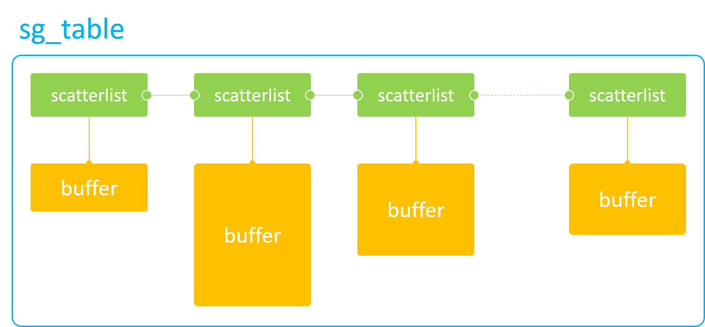
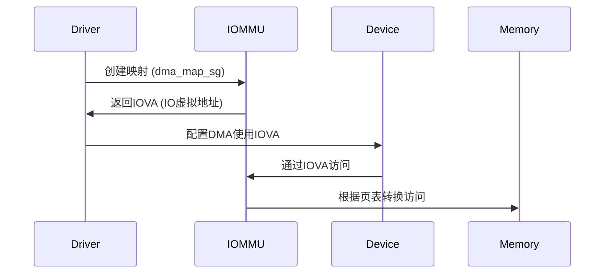
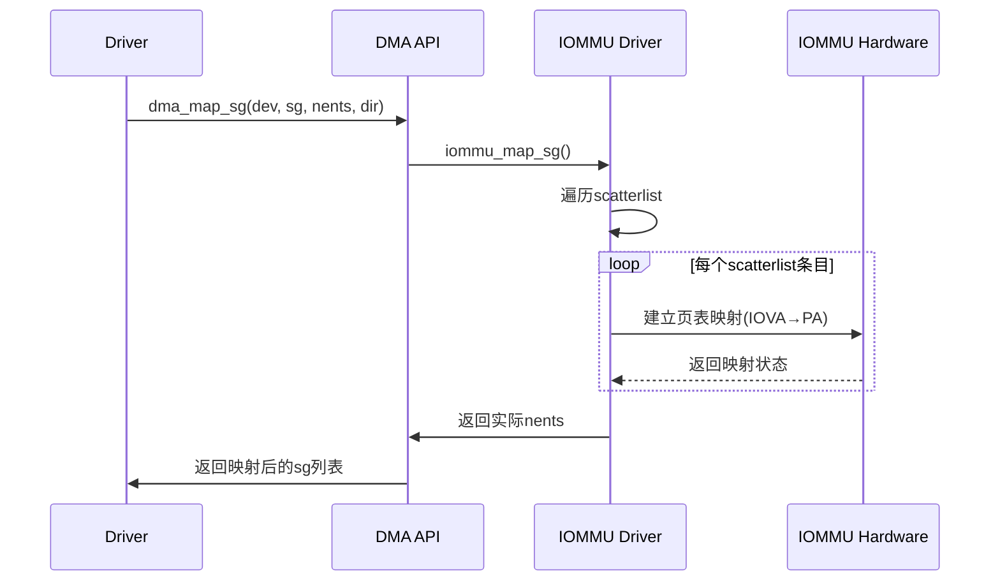
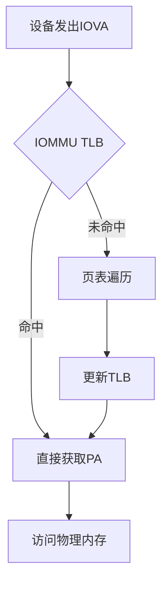
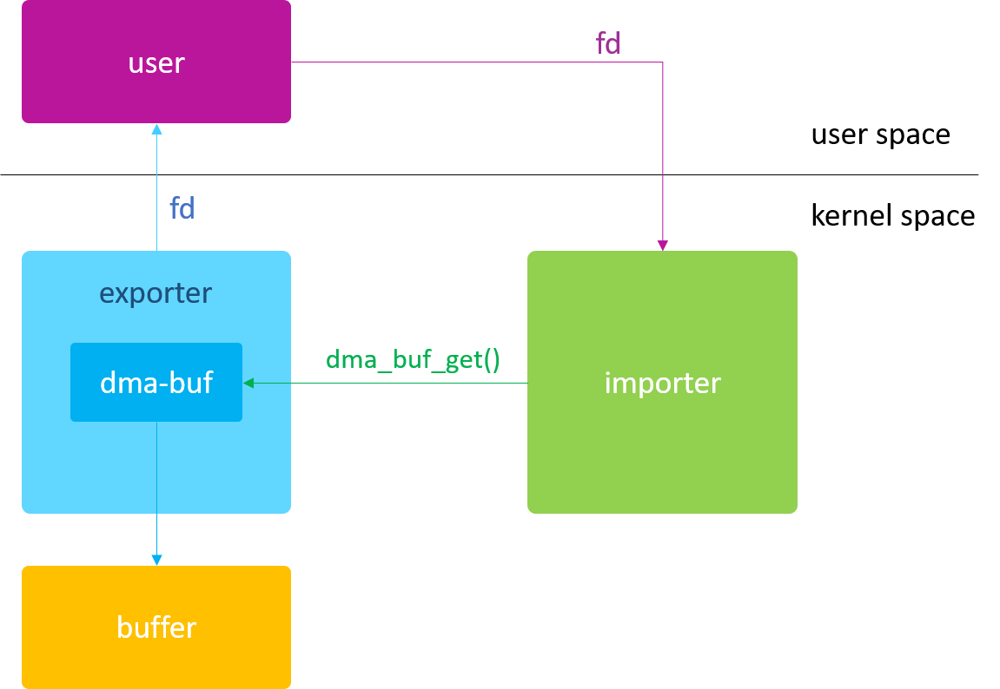

# dma-buf 由浅入深

reference:  
[dma-buf 由浅入深](https://blog.csdn.net/hexiaolong2009/article/details/102596744)

dma-buf 子系统提供了用于`跨多个设备驱动程序`和`子系统共享硬件(DMA)访问缓冲区`以及`同步异步硬件
访问`的框架。不管是 Video、Camera 还是 Display、GPU，它们的buffer都来自于ION，而 ION 正是
基于 dma-buf 实现的。

**dma-buf 是基于流式DMA实现的。**

## 最简单的 dma-buf 驱动程序

### 历史
dma-buf 最初的原型为 shrbuf，由 Marek Szyprowski （Samsung）于2011年8月2日首次提出，
他实现了 “Buffer Sharing” 的概念验证（Proof-of-Concept），并在三星平台的 V4L2 驱动中
实现了 camera 与 display 的 buffer 共享问题。但是由于内核没有现成的框架支持，导致各个
厂商实现的驱动五花八门，此时急需要一个统一的框架来解决 buffer 共享问题。

于是 Sumit Semwal (Linaro) 基于 Marek Szyprowski 的 patch 重构了一套新的框架，也就是
我们今天看到的 dma-buf 核心代码，它于 2012 年 2 月 merge 到了 Linux-3.3 主线版本中，这
也是 dma-buf 的第一个正式版本。此后 dma-buf 被广泛应用于内核多媒体驱动开发中，尤其在 V4L2、
DRM 子系统中得到了充分应用。

### 概念

dma-buf 的出现就是为了解决各个驱动之间 buffer 共享的问题，因此它本质上是 buffer 与 file 的
结合，即 dma-buf 既是块物理 buffer，又是个 linux file。buffer 是内容，file 是媒介，只有
通过 file 这个媒介才能实现同一 buffer 在不同驱动之间的流转。

一个典型的 dma-buf 应用框图如下：


通常，我们将分配 buffer 的模块称为 exporter，将使用该 buffer 的模块称为 importer 或 user。
但在本系列文章中，importer 特指内核空间的使用者，user 特指用户空间的使用者。

```
有的人习惯将 exporter 说成是生产者，importer 说成是消费者，我个人认为这样的说法并不严谨。举例
来说，Android 系统中，graphic buffer 都是由 ION 来分配的，GPU 负责填充该 buffer，DPU 负责
显示该 buffer。那么在这里，ION 则是 exporter，GPU 和 DPU 则都是 importer。但是从生产者/消费
者模型来讲，GPU 则是生产者，DPU 是消费者，因此不能片面的认为 exporter 就是生产者。
```

### 最简单的 dma-buf 驱动程序

如下代码演示了如何编写一个最简单的 dma-buf 驱动程序，我将其称为 dummy 驱动，因为它什么事情也不
做。该代码已经是精简的不能再精简了，少一行代码都不行！

```c
// exporter-dummy.c
#include <linux/dma-buf.h>
#include <linux/module.h>

static struct sg_table *exporter_map_dma_buf(struct dma_buf_attachment *attachment,
                     enum dma_data_direction dir)
{
    return NULL;
}

static void exporter_unmap_dma_buf(struct dma_buf_attachment *attachment,
                   struct sg_table *table, enum dma_data_direction dir)
{
}

static void exporter_release(struct dma_buf *dmabuf)
{
}

static void *exporter_kmap_atomic(struct dma_buf *dmabuf, unsigned long page_num)
{
    return NULL;
}

static void *exporter_kmap(struct dma_buf *dmabuf, unsigned long page_num)
{
    return NULL;
}

static int exporter_mmap(struct dma_buf *dmabuf, struct vm_area_struct *vma)
{
    return -ENODEV;
}

static const struct dma_buf_ops exp_dmabuf_ops = {
    .map_dma_buf = exporter_map_dma_buf,
    .unmap_dma_buf = exporter_unmap_dma_buf,
    .release = exporter_release,
    .map_atomic = exporter_kmap_atomic,
    .map = exporter_kmap,
    .mmap = exporter_mmap,
};

static int __init exporter_init(void)
{
    DEFINE_DMA_BUF_EXPORT_INFO(exp_info);
    struct dma_buf *dmabuf;

    exp_info.ops = &exp_dmabuf_ops;
    exp_info.size = PAGE_SIZE;
    exp_info.flags = O_CLOEXEC;
    exp_info.priv = "null";

    dmabuf = dma_buf_export(&exp_info);

    return 0;
}

module_init(exporter_init);
```

从上面的代码来看，要实现一个 dma-buf exporter驱动，需要执行3个步骤：
* dma_buf_ops
* DEFINE_DMA_BUF_EXPORT_INFO
* dma_buf_export()

注意： 其中 dma_buf_ops 的回调接口中，如下接口又是必须要实现的，缺少任何一个都将导致
dma_buf_export() 函数调用失败！
* map_dma_buf
* unmap_dma_buf
* map
* map_atomic
* mmap
* release


新版本kernel中 dma_buf_ops 的定义
```c
struct dma_buf_ops {
    bool cache_sgt_mapping;

    // for dma_buf_attach() -- device
    int (*attach)(struct dma_buf *, struct dma_buf_attachment *);
    void (*detach)(struct dma_buf *, struct dma_buf_attachment *);

    int (*pin)(struct dma_buf_attachment *attach);
    void (*unpin)(struct dma_buf_attachment *attach);

    // for dma_buf_map_attachment() -- device
    struct sg_table * (*map_dma_buf)(struct dma_buf_attachment *,
                     enum dma_data_direction);
    void (*unmap_dma_buf)(struct dma_buf_attachment *, struct sg_table *,
                  enum dma_data_direction);

    void (*release)(struct dma_buf *);

    // for cache -- user/kernel space
    int (*begin_cpu_access)(struct dma_buf *, enum dma_data_direction);
    int (*end_cpu_access)(struct dma_buf *, enum dma_data_direction);

    // for dma_buf_mmap() -- user space
    int (*mmap)(struct dma_buf *, struct vm_area_struct *vma);
    // for dma_buf_vmap() -- kernel space
    int (*vmap)(struct dma_buf *dmabuf, struct iosys_map *map);
    void (*vunmap)(struct dma_buf *dmabuf, struct iosys_map *map);
};
```


## 内核空间访问DMA -- kmap / vmap

在本节中，将在 exporter-dummy 驱动的基础上，对其 dma_buf_ops 的 kmap / vmap 接口进行扩展，
以此来演示这两个接口的使用方法。

### dma-buf 只能用于 DMA 硬件访问吗？

**dma-buf 本质上是 buffer 与 file 的结合，因此它仍然是一块 buffer**。不要看它带了 dma 字样
就被迷惑了，dma-buf 不仅能用于 DMA 硬件访问，也同样适用于 CPU 软件访问，这也是 dma-buf 在内核
中大受欢迎的一个重要原因。

### dma-buf 只能分配离散 buffer 吗？

就和内核中 dma-mapping 接口一样，dma-buf 既可以是物理连续的 buffer，也可以是离散的 buffer，
这最终取决于 exporter 驱动采用何种方式来分配 buffer。为了尽量易于理解，特意使用了内核中最简单、
最常见的 kzalloc() 函数来分配 dma-buf，自然，这块 buffer 就是物理连续的了。

### CPU Access

从 linux-3.4 开始，dma-buf 引入了 CPU 操作接口，使得开发人员可以在内核空间里直接使用 CPU 来
访问 dma-buf 的物理内存。

如下 dma-buf API 实现了 CPU 在内核空间对 dma-buf 内存的访问，（它们的反向操作分别对应各自的
 unmap 接口）：
* dma_buf_kmap()
* dma_buf_kmap_atomic()
* dma_buf_vmap()

通过以上接口，就可以把实际的物理内存，映射到 kernel 空间，并转化成 CPU 可以连续访问的虚拟地址，
方便后续软件直接读写这块物理内存。因此，无论这块 buffer 在物理上是否连续，在经过以上接口映射后
的虚拟地址一定是连续的。

上述的3个接口分别和 linux 内存管理子系统（MM）中的 kmap()、 kmap_atomic() 和 vmap() 函数
一一对应，三者的区别如下：
|函数 | 说明 |
|--|--|
| kmap() | 一次只能映射1个page，可能会睡眠，只能在进程上下文中调用 |
| kmap_atomic() | 一次只能映射1个page，不会睡眠，可在中断上下文中调用 |
| vmap() | 一次可以映射多个pages，且这些pages物理上可以不连续，只能在进程上下文中调用 |


```
注意：
1. 从 linux-4.19 开始，dma_buf_kmap_atomic() 不再被支持。
2. dma_buf_ops 中的 map / map_atomic 接口名，其实原本就叫 kmap / kmap_atomic，只是后来
发现与 highmem.h 中的宏定义重名了，为了避免开发人员在自己的驱动中引用 highmem.h 而带来的命名
冲突问题，于是去掉了前面的“k”字。
```


### 示例程序

本示例分为 exporter 和 importer 两个驱动。

首先是基于上一篇 exporter-dummy.c 的驱动，对其 exporter_kmap() 和 exporter_vmap() 
进行扩展，具体如下：
```c
// exporter-kmap.c
#include <linux/dma-buf.h>
#include <linux/module.h>
#include <linux/slab.h>

struct dma_buf *dmabuf_exported;
EXPORT_SYMBOL(dmabuf_exported);

static void *exporter_kmap(struct dma_buf *dmabuf, unsigned long page_num)
{
    return dmabuf->priv;
}

static void *exporter_kmap_atomic(struct dma_buf *dmabuf, unsigned long page_num)
{
    return dmabuf->priv;
}

static void *exporter_vmap(struct dma_buf *dmabuf)
{
    return dmabuf->priv;
}

static void exporter_release(struct dma_buf *dmabuf)
{
    kfree(dmabuf->priv);
}

...

static const struct dma_buf_ops exp_dmabuf_ops = {
    .map = exporter_kmap,
    .map_atomic = exporter_kmap_atomic,
    .vmap = exporter_vmap,
    .release = exporter_release,
    ...
};

static struct dma_buf *exporter_alloc_page(void)
{
    DEFINE_DMA_BUF_EXPORT_INFO(exp_info);
    struct dma_buf *dmabuf;
    void *vaddr;

    vaddr = kzalloc(PAGE_SIZE, GFP_KERNEL);

    exp_info.ops = &exp_dmabuf_ops;
    exp_info.size = PAGE_SIZE;
    exp_info.flags = O_CLOEXEC;
    exp_info.priv = vaddr;

    dmabuf = dma_buf_export(&exp_info);

    sprintf(vaddr, "hello world!");

    return dmabuf;
}

static int __init exporter_init(void)
{
    dmabuf_exported = exporter_alloc_page();
    return 0;
}

module_init(exporter_init);
```

然后编写一个 importer 驱动，演示如何在 kernel 空间，通过 dma_buf_kmap() / dma_buf_vmap() 
接口操作 exporter 驱动导出的 dma-buf。

```c
// importer-kmap.c
#include <linux/dma-buf.h>
#include <linux/module.h>
#include <linux/slab.h>

extern struct dma_buf *dmabuf_exported;

static int importer_test(struct dma_buf *dmabuf)
{
    void *vaddr;

    vaddr = dma_buf_kmap(dmabuf, 0);
    pr_info("read from dmabuf kmap: %s\n", (char *)vaddr);
    dma_buf_kunmap(dmabuf, 0, vaddr);

    vaddr = dma_buf_vmap(dmabuf);
    pr_info("read from dmabuf vmap: %s\n", (char *)vaddr);
    dma_buf_vunmap(dmabuf, vaddr);

    return 0;
}

static int __init importer_init(void)
{
    return importer_test(dmabuf_exported);
}

module_init(importer_init);
```

示例描述：
1. exporter 通过 kzalloc 分配了一个 PAGE 大小的物理连续 buffer，并向该 buffer 写入了
“hello world!” 字符串；
2. importer 驱动通过 extern 关键字导入了 exporter 的 dma-buf，并通过 dma_buf_kmap()、
dma_buf_vmap() 函数读取该 buffer 的内容并输出到终端显示。


## 硬件访问 DMA -- map attachment

在上一节，学习了如何使用 CPU 在 kernel 空间访问 dma-buf 物理内存，但通常这种操作方法在内核中出
现的频率并不高，因为 dma-buf 设计之初就是为满足那些大内存访问需求的硬件而设计的，如GPU/DPU。在
这种场景下，如果使用CPU直接去访问 memory，那么性能会大大降低。因此，dma-buf 在内核中出现频率最高
的还是它的`dma_buf_attach()`和`dma_buf_map_attachment()`接口。本篇我们就一起来学习如何通过
这两个 API 来实现 DMA 硬件对 dma-buf 物理内存的访问。

### DMA Access

dma-buf 提供给 DMA 硬件访问的 API 主要就两个：
* dma_buf_attach()
* dma_buf_map_attachment()

这两个接口调用有严格的先后顺序，必须先 attach，再 map attachment，因为后者的参数是由前者提供
的，所以通常这两个接口形影不离。与上面两个 API 相对应的反向操作接口为： dma_buf_dettach() 和
dma_buf_unmap_attachment()。

### sg_table

sg_table 是 dma-buf 供 DMA 硬件访问的终极目标，也是 DMA 硬件访问离散 memory 的唯一途径！
sg_table 本质上是由一块块单个物理连续的 buffer 所组成的链表，但是这个链表整体上看却是离散的，
因此它可以很好的描述从 高端内存 上分配出的离散 buffer。当然，它同样可以用来描述从`低端内存`上
分配出的物理连续 buffer。如下图所示：


sg_table 代表着整个链表，而它的每一个链表项则由 scatterlist 来表示。因此，1个scatterlist 
也就对应着一块 物理连续 的 buffer。我们可以通过如下接口来获取一个 scatterlist 对应 buffer 
的物理地址和长度：
* sg_dma_address(sgl)
* sg_dma_len(sgl)

有了 buffer 的物理地址和长度，我们就可以将这两个参数配置到 DMA 硬件寄存器中，这样就可以实现
`DMA`硬件对这一小块 buffer 的访问。那如何访问整块离散`buffer`呢？当然是用个`for`循环，不断的
解析`scatterlist`，不断的配置 DMA 硬件寄存器。

```
对于现代多媒体硬件来说，IOMMU 的出现，解决了程序员编写 for 循环的烦恼。因为在 for 循环中，每次
配置完 DMA 硬件寄存器后，都需要等待本次 DMA 传输完毕，然后才能进行下一次循环，这大大降低了软件的
执行效率。而 IOMMU 的功能就是用来解析 sg_table 的，它会将 sg_table 内部一个个离散的小buffer
映射到自己内部的设备地址空间，使得这整块 buffer 在自己内部的设备地址空间上是连续的。这样，在访问
离散 buffer 的时候，只需要将 IOMMU 映射后的设备地址（与 MMU 映射后的 CPU 虚拟地址不是同一概
念）和整块 buffer 的 size 配置到 DMA 硬件寄存器中即可，中途无需再多次配置，便完成了 DMA 硬件
对整块离散 buffer 的访问，大大的提高了软件的效率。
```


#### Scatter-Gather 列表的核心函数

**基本初始化**
```c
#include <linux/scatterlist.h>

// 初始化SG表
#define SG_MAX_SINGLE_ALLOC 4096
struct scatterlist sg[10];
sg_init_table(sg, 10);  // 初始化10个元素的SG表

// 动态分配SG表
struct scatterlist *sglist;
int nents = dma_map_sg(dev, sglist, nents, direction);
```

**常见操作函数**
| 函数 | 作用描述 |
|--|--|
| sg_init_table()  | 初始化静态分配的SG表     |
| sg_alloc_table() | 动态分配SG表             |
| sg_free_table()  | 释放SG表                 |
| sg_set_buf()     | 设置SG条目指向指定缓冲区 |
| dma_map_sg()     | 为DMA操作映射SG列表      |
| dma_unmap_sg()   | 解除DMA映射              |


#### 与IOMMU的交互机制

##### 无IOMMU的情况：
```c
// 直接使用物理地址
sg_dma_address(sg) = sg_phys(sg);
```

##### 有IOMMU的情况：


**关键转换过程**：
1. `dma_map_sg()` 会遍历scatterlist：
   - 为每个物理块创建IOMMU页表项
   - 返回映射后的IOVA地址
2. 设备看到的是连续的IOVA空间
3. IOMMU硬件自动完成地址转换


#### 从驱动角度详细解析

实际上 IOMMU **不会直接遍历 scatterlist 结构**，但会利用 scatterlist 提供的信息
建立映射。以下是详细解释：

##### 映射过程的真实流程

当调用 `dma_map_sg()` 时发生的实际操作：



这里的 dma_map_sg 可以与 dma_buf_map_attachment 对应，即建立 sg_table，也就是
常说的建表

##### 关键区别：建立映射 vs 使用映射

- **映射建立阶段**（软件行为）：
  - 内核**确实需要遍历** scatterlist 的每个条目
  - 为每个物理内存块创建 IOMMU 页表项
  - 此阶段发生在驱动初始化或数据传输前

- **DMA传输阶段**（硬件行为）：
  - 设备**不再感知** scatterlist 结构
  - 设备只看到连续的 IOVA 空间
  - IOMMU 硬件**自动完成**地址转换
  - 完全不涉及 scatterlist 的遍历

##### 性能优化实现

现代 IOMMU 驱动会智能处理 scatterlist：

```c
// 实际内核代码的简化逻辑 (drivers/iommu/dma-iommu.c)
int iommu_dma_map_sg(struct device *dev, struct scatterlist *sg,
                    int nents, int prot)
{
    for_each_sg(sg, s, nents, i) {
        phys_addr_t phys = sg_phys(s);
        size_t len = s->length;

        /* 尝试合并相邻的物理块 */
        if (i > 0 && phys == prev_phys + prev_len) {
            prev_len += len;
            continue;
        }

        /* 建立IOMMU映射 */
        iommu_map(domain, iova, phys, len, prot);
        sg_dma_address(s) = iova;

        prev_phys = phys;
        prev_len = len;
        iova += len;
    }
}
```

##### 硬件视角的真实行为

设备发起 DMA 时的硬件级操作：


**关键点**：
- 设备**永远看不到** scatterlist
- IOMMU 硬件**只处理** IOVA→PA 的转换
- 转换过程**不涉及** scatterlist 数据结构


### dma_buf_attach()

该函数实际是 “dma-buf attach device” 的缩写，用于建立一个 dma-buf 与 device 的连接关系，
该关系存放在新创建的`struct dma_buf_attachment`对象中，供后续调用dma_buf_map_attachment()
使用。

该函数对应 dma_buf_ops 中的 attach 回调接口，如果 device 对后续的 map attachment 操作没有
什么特殊要求，可以不实现。


### dma_buf_map_attachment()

该函数实际是 “dma-buf map attachment into sg_table” 的缩写，它主要完成2件事情：
* 生成 sg_table
* 同步 Cache

选择返回 sg_table 而不是物理地址，是为了兼容所有 DMA 硬件（带或不带 IOMMU），因为 sg_table 
既可以表示连续物理内存，也可以表示非连续物理内存。

同步 Cache 是为了防止该 buffer 事先被 CPU 填充过，数据暂存在 Cache 中而非 DDR 上，导致 DMA 
访问的不是最新的有效数据。通过将 Cache 中的数据回写到 DDR 上可以避免此类问题的发生。同样的，在 
DMA 访问内存结束后，需要将 Cache 设置为无效，以便后续 CPU 直接从 DDR 上（而非 Cache 中）读取
该内存数据。通常我们使用如下`流式 DMA 映射`接口来完成 Cache 的同步：
* dma_map_single() / dma_unmap_single()
* dma_map_page() / dma_unmap_page()
* dma_map_sg() / dma_unmap_sg()

dma_buf_map_attachment() 对应 dma_buf_ops 中的 map_dma_buf 回调接口，该回调接口（包括
unmap_dma_buf 在内）被强制要求实现，否则 dma_buf_export() 将执行失败。


### 为什么需要 attach 操作 ？

同一个 dma-buf 可能会被多个 DMA 硬件访问，而每个 DMA 硬件可能会因为自身硬件能力的限制，对这块
 buffer 有自己特殊的要求。比如硬件 A 的寻址能力只有0x0 ~ 0x10000000，而硬件 B 的寻址能力为
 0x0 ~ 0x80000000，那么在分配 dma-buf 的物理内存时，就必须以硬件 A 的能力为标准进行分配，这样
硬件 A 和 B 都可以访问这段内存。否则，如果只满足 B 的需求，那么 A 可能就无法访问超出 
0x10000000 地址以外的内存空间，道理其实类似于木桶理论。

**因此，attach 操作可以让 exporter 驱动根据不同的 device 硬件能力，来分配最合适的物理内存。**

`通过设置 device->dma_params 参数，来告知 exporter 驱动该 DMA 硬件的能力限制。`

但是在上一节的示例中，dma-buf 的物理内存都是在 dma_buf_export() 的时候就分配好了的，而
attach 操作只能在 export 之后才能执行，那我们如何确保已经分配好的内存是符合硬件能力要求的呢？
这就引出了下面的话题。

### 何时分配内存？

答案是：既可以在 export 阶段分配，也可以在 map attachment 阶段分配，甚至可以在两个阶段都分配，这通常由 DMA 硬件能力来决定。

首先，驱动人员需要统计当前系统中都有哪些 DMA 硬件要访问 dma-buf；
然后，根据不同的 DMA 硬件能力，来决定在何时以及如何分配物理内存。

通常的策略如下（假设只有 A、B 两个硬件需要访问 dma-buf ）：
* 如果硬件 A 和 B 的寻址空间有交集，则在 export 阶段进行内存分配，分配时以 A / B 的交集为准；
* 如果硬件 A 和 B 的寻址空间没有交集，则只能在 map attachment 阶段分配内存。

对于第二种策略，因为 A 和 B 的寻址空间没有交集（即完全独立），所以它们实际上是无法实现内存共享的。
此时的解决办法是： A 和 B 在 map attachment 阶段，都分配各自的物理内存，然后通过 CPU 或`通用
DMA`硬件，将 A 的 buffer 内容拷贝到 B 的 buffer 中去，以此来间接的实现 buffer “共享”。

另外还有一种策略，就是不管三七二十一，先在 export 阶段分配好内存，然后在首次 map attachment 阶
段通过 dma_buf->attachments 链表，与所有 device 的能力进行一一比对，如果满足条件则直接返回
sg_table；如果不满足条件，则重新分配符合所有 device 要求的物理内存，再返回新的 sg_table。

### 示例代码

本示例基于第一节的 exporter-dummy.c 进行修改，对 dma_buf_ops 中的 attach 和 map_dma_buf
回调接口进行实现。当然，为了方便演示，我们仍然像之前那样，在 exporter_alloc_page() 中事先分配
好了 dma-buf 的物理内存。

```c
// exporter-sg.c
#include <linux/dma-buf.h>
#include <linux/module.h>
#include <linux/slab.h>

struct dma_buf *dmabuf_exported;
EXPORT_SYMBOL(dmabuf_exported);

static int exporter_attach(struct dma_buf *dmabuf, struct device *dev,
            struct dma_buf_attachment *attachment)
{
    pr_info("dmabuf attach device: %s\n", dev_name(dev));
    return 0;
}

static void exporter_detach(struct dma_buf *dmabuf, struct dma_buf_attachment *attachment)
{
    pr_info("dmabuf detach device: %s\n", dev_name(attachment->dev));
}

static struct sg_table *exporter_map_dma_buf(struct dma_buf_attachment *attachment,
                     enum dma_data_direction dir)
{
    void *vaddr = attachment->dmabuf->priv;
    struct sg_table *table;

    table = kmalloc(sizeof(*table), GFP_KERNEL);

    sg_alloc_table(table, 1, GFP_KERNEL);
    sg_dma_len(table->sgl) = PAGE_SIZE;
    sg_dma_address(table->sgl) = dma_map_single(NULL, vaddr, PAGE_SIZE, dir);

    return table;
}

static void exporter_unmap_dma_buf(struct dma_buf_attachment *attachment,
                   struct sg_table *table,
                   enum dma_data_direction dir)
{
    dma_unmap_single(NULL, sg_dma_address(table->sgl), PAGE_SIZE, dir);
    sg_free_table(table);
    kfree(table);
}

...

static const struct dma_buf_ops exp_dmabuf_ops = {
    .attach = exporter_attach,
    .detach = exporter_detach,
    .map_dma_buf = exporter_map_dma_buf,
    .unmap_dma_buf = exporter_unmap_dma_buf,
    ...
};

static struct dma_buf *exporter_alloc_page(void)
{
    DEFINE_DMA_BUF_EXPORT_INFO(exp_info);
    struct dma_buf *dmabuf;
    void *vaddr;

    vaddr = kzalloc(PAGE_SIZE, GFP_KERNEL);

    exp_info.ops = &exp_dmabuf_ops;
    exp_info.size = PAGE_SIZE;
    exp_info.flags = O_CLOEXEC;
    exp_info.priv = vaddr;

    dmabuf = dma_buf_export(&exp_info);

    sprintf(vaddr, "hello world!");

    return dmabuf;
}

static int __init exporter_init(void)
{
    dmabuf_exported = exporter_alloc_page();
    return 0; 
}

module_init(exporter_init);
```

在上面的 attach 实现中，我们仅仅只是打印了一句 log，其他什么事情也不做。在 map_dma_buf 实现
中，我们构造了一个 sg_table 对象，并通过调用 dma_map_single() 来获取 dma_addr 以及实现
 Cache 同步操作。

```c
// importer-sg.c
#include <linux/device.h>
#include <linux/dma-buf.h>
#include <linux/module.h>
#include <linux/slab.h>

extern struct dma_buf *dmabuf_exported;

static int importer_test(struct dma_buf *dmabuf)
{
    struct dma_buf_attachment *attachment;
    struct sg_table *table;
    struct device *dev;
    unsigned int reg_addr, reg_size;

    dev = kzalloc(sizeof(*dev), GFP_KERNEL);
    dev_set_name(dev, "importer");

    attachment = dma_buf_attach(dmabuf, dev);
    table = dma_buf_map_attachment(attachment, DMA_BIDIRECTIONAL);

    reg_addr = sg_dma_address(table->sgl);
    reg_size = sg_dma_len(table->sgl);
    pr_info("reg_addr = 0x%08x, reg_size = 0x%08x\n", reg_addr, reg_size);

    dma_buf_unmap_attachment(attachment, table, DMA_BIDIRECTIONAL);
    dma_buf_detach(dmabuf, attachment);

    return 0;
}

static int __init importer_init(void)
{
    return importer_test(dmabuf_exported);
}

module_init(importer_init);
```

示例描述：
1. exporter 通过 kzalloc 分配了一个 PAGE 大小的物理连续 buffer；
2. importer驱动通过extern关键字导入了exporter的dma-buf，并通过 dma_buf_map_attachment()
接口获取到了该物理内存所对应的sg_table，然后将该sg_table中的address和size解析到reg_addr和
reg_size这两个虚拟寄存器中。

## 用户空间访问DMA -- mmap

reference:  
[认真分析mmap：是什么 为什么 怎么用 ](https://www.cnblogs.com/huxiao-tee/p/4660352.html)   
[内存映射函数remap_pfn_range学习——示例分析（1）](https://www.cnblogs.com/pengdonglin137/p/8149859.html)

### mmap

为了方便应用程序能直接在用户空间读写dma-buf的内存，dma_buf_ops为我们提供了一个mmap回调接口，
可以把dma-buf的物理内存直接映射到用户空间，这样应用程序就可以像访问普通文件那样访问dma-buf的
物理内存了。

在 Linux 设备驱动中，大多数驱动的 mmap 操作接口都是通过调用 remap_pfn_range() 函数来实现的，
dma-buf 也不例外。可以查阅本节开始位置的参考资料，以便有更深入的了解。

除了 dma_buf_ops 提供的 mmap 回调接口外，dma-buf 还为我们提供了 dma_buf_mmap() 内核 API，
使得我们可以在其他设备驱动中就地取材，直接引用 dma-buf 的 mmap 实现，以此来间接的实现设备驱动的
 mmap 文件操作接口。

### 示例


接下来，将通过两个示例来演示如何在 Userspace 访问 dma-buf 的物理内存。
示例一：直接使用 dma-buf 的 fd 做 mmap() 操作
示例二：使用 exporter 的 fd 做 mmap() 操作

#### 示例一
本例主要演示如何在驱动层实现 dma-buf 的 mmap 回调接口，以及如何在用户空间直接使用 dma-buf 的
 fd 进行 mmap() 操作。

**exporter 驱动**

首先，我们仍然基于第一节的 exporter-dummy.c 驱动来实现 mmap 回调接口：
```c
// exporter-fd.c
#include <linux/dma-buf.h>
#include <linux/module.h>
#include <linux/miscdevice.h>
#include <linux/slab.h>
#include <linux/uaccess.h>

struct dma_buf *dmabuf_exported;
EXPORT_SYMBOL(dmabuf_exported);

static int exporter_mmap(struct dma_buf *dmabuf, struct vm_area_struct *vma)
{
    void *vaddr = dmabuf->priv;

    return remap_pfn_range(vma, vma->vm_start, virt_to_pfn(vaddr),
                PAGE_SIZE, vma->vm_page_prot);
}

...

static const struct dma_buf_ops exp_dmabuf_ops = {
    ...
    .mmap = exporter_mmap,
};

static struct dma_buf *exporter_alloc_page(void)
{
    DEFINE_DMA_BUF_EXPORT_INFO(exp_info);
    struct dma_buf *dmabuf;
    void *vaddr;

    vaddr = kzalloc(PAGE_SIZE, GFP_KERNEL);

    exp_info.ops = &exp_dmabuf_ops;
    exp_info.size = PAGE_SIZE;
    exp_info.flags = O_CLOEXEC;
    exp_info.priv = vaddr;

    dmabuf = dma_buf_export(&exp_info);

    sprintf(vaddr, "hello world!");

    return dmabuf;
}

static long exporter_ioctl(struct file *filp, unsigned int cmd, unsigned long arg)
{
    int fd = dma_buf_fd(dmabuf_exported, O_CLOEXEC);
    copy_to_user((int __user *)arg, &fd, sizeof(fd));

    return 0;
}
 
static struct file_operations exporter_fops = {
    .owner        = THIS_MODULE,
    .unlocked_ioctl    = exporter_ioctl,
};
 
static struct miscdevice mdev = {
    .minor = MISC_DYNAMIC_MINOR,
    .name = "exporter",
    .fops = &exporter_fops,
};
 
static int __init exporter_init(void)
{
    dmabuf_exported = exporter_alloc_page();
    return misc_register(&mdev);
}

static void __exit exporter_exit(void)
{
    misc_deregister(&mdev);
}

module_init(exporter_init);
module_exit(exporter_exit);
```

从上面的示例可以看到，除了要实现 dma-buf 的 mmap 回调接口外，我们还引入了 misc driver，目的是
想通过 misc driver 的 ioctl 接口将 dma-buf 的 fd 传递给上层应用程序，这样才能实现应用程序直
接使用这个 dma-buf fd 做 mmap() 操作。

`为什么非要通过 ioctl 的方式来传递 fd ？这个问题我会在下一节《File》中详细讨论。`

`
在 ioctl 接口中，使用到了 dma_buf_fd() 函数，用于创建一个新的 fd，并与该 dma-buf 的文件相
绑定。关于该函数，我也会在下一节中做详细介绍。
`

**userspace 程序**

```c
// mmap_dmabuf.c
int main(int argc, char *argv[])
{
    int fd;
    int dmabuf_fd = 0;

    fd = open("/dev/exporter", O_RDONLY);
    ioctl(fd, 0, &dmabuf_fd);
    close(fd);

    char *str = mmap(NULL, 4096, PROT_READ, MAP_SHARED, dmabuf_fd, 0);
    printf("read from dmabuf mmap: %s\n", str);

    return 0;
}
```

可以看到 userspace 的代码非常简单，首先通过 exporter 驱动的 ioctl() 获取到 dma-buf 的 fd，
然后直接使用该 fd 做 mmap() 映射，最后使用 printf() 来输出映射后的 buffer 内容。

#### 示例二

本示例主要演示如何使用 dma_buf_mmap() 内核 API，以此来简化设备驱动的mmap文件操作接口的实现。

**exporter 驱动**

我们基于示例一中的exporter-fd.c文件，删除exporter_ioctl()函数，新增exporter_misc_mmap()
函数，具体修改如下：

```c
// exporter-mmap.c
#include <linux/dma-buf.h>
#include <linux/module.h>
#include <linux/miscdevice.h>
#include <linux/slab.h>
#include <linux/uaccess.h>

struct dma_buf *dmabuf_exported;
EXPORT_SYMBOL(dmabuf_exported);

static int exporter_mmap(struct dma_buf *dmabuf, struct vm_area_struct *vma)
{
    void *vaddr = dmabuf->priv;

    return remap_pfn_range(vma, vma->vm_start, virt_to_pfn(vaddr),
                PAGE_SIZE, vma->vm_page_prot);
}

...
static const struct dma_buf_ops exp_dmabuf_ops = {
    ...
    .mmap = exporter_mmap,
};

static struct dma_buf *exporter_alloc_page(void)
{
    DEFINE_DMA_BUF_EXPORT_INFO(exp_info);
    struct dma_buf *dmabuf;
    void *vaddr;

    vaddr = kzalloc(PAGE_SIZE, GFP_KERNEL);

    exp_info.ops = &exp_dmabuf_ops;
    exp_info.size = PAGE_SIZE;
    exp_info.flags = O_CLOEXEC;
    exp_info.priv = vaddr;

    dmabuf = dma_buf_export(&exp_info);

    sprintf(vaddr, "hello world!");

    return dmabuf;
}

static int exporter_misc_mmap(struct file *file, struct vm_area_struct *vma)
{
    return dma_buf_mmap(dmabuf_exported, vma, 0);
}

static struct file_operations exporter_fops = {
    .owner    = THIS_MODULE,
    .mmap    = exporter_misc_mmap,
};
 
static struct miscdevice mdev = {
    .minor = MISC_DYNAMIC_MINOR,
    .name = "exporter",
    .fops = &exporter_fops,
};
 
static int __init exporter_init(void)
{
    dmabuf_exported = exporter_alloc_page();
    return misc_register(&mdev);
}

static void __exit exporter_exit(void)
{
    misc_deregister(&mdev);
}

module_init(exporter_init);
module_exit(exporter_exit);
```

与示例一的驱动相比，示例二的驱动不再需要把 dma-buf 的 fd 通过 ioctl 传给上层，而是直接将
 dma-buf 的 mmap 回调接口嫁接到 misc driver 的 mmap 文件操作接口上。这样上层在对 misc
 device 进行 mmap() 操作时，实际映射的是 dma-buf 的物理内存。


**userspace 程序**

```c
// mmap_exporter.c
int main(int argc, char *argv[])
{
    int fd;

    fd = open("/dev/exporter", O_RDONLY);

    char *str = mmap(NULL, 4096, PROT_READ, MAP_SHARED, fd, 0);
    printf("read from /dev/exporter mmap: %s\n", str);

    close(fd);

    return 0;
}
```

与示例一的 userspace 程序相比，示例二不再通过 ioctl() 方式获取 dma-buf 的 fd，而是直接使用
exporter misc device 的 fd 进行 mmap() 操作，此时执行的则是 misc driver 的 mmap 文件操作
接口。当然最终输出的结果都是一样的。


## 通过FD共享DMA -- File

references:  
[Android Binder传递文件描述符原理分析](https://blog.csdn.net/zhangjg_blog/article/details/83502195)  
[进程间传递文件描述符--sendmsg,recvmsg](https://blog.csdn.net/majianfei1023/article/details/51454797)

### file

**dma-buf 本质上是 buffer 与 file 的结合**，不仅如此，该 file 还是个被 open 过的 file。
从我们调用dma_buf_export()开始，这个file就已经被 open 了。而且该 file 还是个**匿名文件**，
因此应用程序无法通过`fd = open(“name”)`的方式来获取它所对应的 fd，只能依托于 exporter 驱动
的 ioctl 接口，通过 dma_buf_fd() 来获取，

### fd

如下内核 API 实现了 dma-buf 与 fd 之间的相互转换：
* dma_buf_fd()：dma-buf --> new fd
* dma_buf_get()：fd --> dma-buf
通常使用方法如下：
```c
fd = dma_buf_fd(dmabuf);
dmabuf = dma_buf_get(fd);
```

### get / put

只要是文件，内部都会有一个引用计数（f_count）。当使用 dma_buf_export() 函数创建 dma-buf 时，该引用计数被初始化为1；当这个引用计数为0时，则会自动触发 dma_buf_ops 的 release 回调接口，并释放 dma-buf 对象。

在 linux 内核中操作 file 引用计数的常用函数为 fget() 和 fput()，而 dma-buf 又在此基础上进行了封装，如下：
* get_dma_buf()
* dma_buf_get()
* dma_buf_put()

为了不引起混淆，做如下表格区分：

| 函数 | 区别 |
|--|--|
| get_dma_buf() | 仅引用计数加1 |
| dma_buf_put() | 引用计数减1 |
| dma_buf_fd() | 引用计数不变，仅创建 fd |
| dma_buf_get() | 引用计数加1，并将 fd 返回绑定的 dma_buf 指针 |


### dma_buf_attach / dma_buf_attachment / dma_buf_map_attachment

`dma_buf_attach()` 函数用于将 DMA 缓冲区与一个或多个设备进行关联，主要是为 DMA 缓冲区
和设备之间的通信建立一个关联，以便在进行 DMA 操作时可以有效地传输数据，原型如下：
```C
struct dma_buf_attachment *dma_buf_attach(struct dma_buf *dmabuf, struct device *dev);
```
参数 dmabuf 是指向 DMA 缓冲区结构的指针，dev 则是指向设备结构的指针。
这个函数会建立 DMA 缓冲区和设备之间的连接，并返回一个指向 dma_buf_attachment 结构的
指针，后续可以用于执行其他 DMA 缓冲区操作。


`dma_buf_attachment()` 函数用于获取与特定 DMA 缓冲区和设备相关联的 DMA 缓冲区结构。
其原型通常为：
```C
struct dma_buf_attachment *dma_buf_attachment(struct dma_buf *dmabuf, struct device *dev);
```
参数与 dma_buf_attach() 类似，需要提供 DMA 缓冲区和设备的指针。该函数返回一个指向
dma_buf_attachment 结构体的指针，该结构包含了 DMA 缓冲区和设备之间的连接信息。
dma_buf_attachment() 函数通常用于在执行 DMA 操作之前获取与 DMA 缓冲区相关联的设备
信息，以便进行必要的设置和配置。


dma_buf_map_attachment 是 Linux 内核中用于将 DMA 缓冲区映射到设备的函数之一。DMA 缓冲区
是用于数据传输的内存区域，而设备可能需要直接访问这些内存区域进行数据传输，例如通过
DMA 控制器进行高速数据传输。dma_buf_map_attachment 的作用是在设备驱动程序中将 DMA 缓冲区
映射到设备的地址空间，以便设备可以直接访问这些内存区域。原型如下：
```C
struct sg_table *dma_buf_map_attachment(struct dma_buf_attachment *attach, enum dma_data_direction direction)
```
以下是关于 dma_buf_map_attachment 的一般用法说明：
1. 获取 DMA 缓冲区的 attachment 对象：在使用 dma_buf_map_attachment 之前，需要获取
   DMA 缓冲区的 attachment 对象。这通常是通过调用 dma_buf_map 或类似的函数来获得的。
2. 设置 DMA 映射参数：在调用 dma_buf_map_attachment 之前，需要设置好 DMA 映射的参数，
   这些参数包括 DMA 方向（读取或写入）、DMA 偏移、DMA 传输长度等。
3. 调用 dma_buf_map_attachment 进行映射：一旦设置好 DMA 映射参数，就可以调用 dma_buf_map_attachment 函数
   来进行映射。这会返回设备可用的地址映射，以便设备可以访问 DMA 缓冲区的内存。
4. 使用映射后的地址进行数据传输：一旦成功映射了 DMA 缓冲区，设备就可以使用映射后的地址
   进行数据传输，无需通过 CPU 参与。
5. 解除映射：在数据传输完成后，通常需要调用相应的函数来解除 DMA 缓冲区的映射，
   以释放相关资源并确保安全。

注意，这里得到的映射后的虚拟地址是给设备访问的，而不是给CPU访问的，因此通常会作为一个
配置项，配置到设备寄存器中，之后设备就可以使用改地址进行访问。另外注意进行attachment的
过程中会涉及到iommu相关的操作。如果需要cpu（或者用户空间）进行访问，则需要使用mmap函数，
mmap会涉及到mmu相关的操作，细节在此不做展开。


### release
通常 release 回调接口用来释放 dma-buf 所对应的物理 buffer。当然，凡是所有和该 dma-buf 相关的私有数据也都应该在这里被 free 掉。

前面说过，只有当 dma-buf 的引用计数递减到0时，才会触发 release 回调接口。因此
* 如果不想让你正在使用的 buffer 被突然释放，请提前 get；
* 如果想在 kernel space 释放 buffer，请使劲 put；
* 如果想从 user space 释放 buffer，请尝试 close；

这就是为什么在内核设备驱动中，我们会看到那么多 dma-buf get 和 put 的身影。

`
这也是为什么在第一节《最简单的 dma-buf 驱动程序》中，一旦 exporter-dummy.ko 被成功加载了，
就无法被 rmmod 的原因。因为没有任何程序来修改该 dma-buf 的引用计数，自始自终都保持为1，所以
也就无法执行 release 接口，更不会执行 module put。
`

### 示例

在前面所有的 exporter 驱动中，都定义了一个 dmabuf_exported 全局变量，方便 importer 驱动
通过 extern 关键字来引用。这就造成了 exporter 驱动与 importer 驱动之间的强耦合，不仅编译时
importer 需要依赖 exporter 的文件，就连运行时也要依赖 exporter 模块先加载。



这次，将 dmabuf_exported 全局变量改为 static 静态变量，并借助于 dma_buf_fd() 与 
dma_buf_get() 来彻底解除 importer 与 exporter 驱动之间的耦合。

**exporter 驱动**

基于上一节示例一中的 exporter 驱动，将 dmabuf_exported 全局变量修改为 static 静态变量，
其它代码不做修改。

```c
// exporter-fd.c
#include <linux/dma-buf.h>
#include <linux/module.h>
#include <linux/miscdevice.h>
#include <linux/slab.h>
#include <linux/uaccess.h>

static struct dma_buf *dmabuf_exported;

...

static struct dma_buf *exporter_alloc_page(void)
{
    DEFINE_DMA_BUF_EXPORT_INFO(exp_info);
    struct dma_buf *dmabuf;
    void *vaddr;

    vaddr = kzalloc(PAGE_SIZE, GFP_KERNEL);

    exp_info.ops = &exp_dmabuf_ops;
    exp_info.size = PAGE_SIZE;
    exp_info.flags = O_CLOEXEC;
    exp_info.priv = vaddr;

    dmabuf = dma_buf_export(&exp_info);

    sprintf(vaddr, "hello world!");

    return dmabuf;
}

static long exporter_ioctl(struct file *filp, unsigned int cmd, unsigned long arg)
{
    int fd = dma_buf_fd(dmabuf_exported, O_CLOEXEC);
    copy_to_user((int __user *)arg, &fd, sizeof(fd));

    return 0;
}
 
static struct file_operations exporter_fops = {
    .owner        = THIS_MODULE,
    .unlocked_ioctl    = exporter_ioctl,
};
 
static struct miscdevice mdev = {
    .minor = MISC_DYNAMIC_MINOR,
    .name = "exporter",
    .fops = &exporter_fops,
};
 
static int __init exporter_init(void)
{
    dmabuf_exported = exporter_alloc_page();
    return misc_register(&mdev);
}

static void __exit exporter_exit(void)
{
    misc_deregister(&mdev);
}

module_init(exporter_init);
module_exit(exporter_exit);
```

在 ioctl 中，通过 dma_buf_fd() 创建一个新的 fd，并通过 copy_to_user() 将该 fd 的值传给
上层应用程序。

**importer 驱动**

基于《kmap/vmap》一节中的 importer-kmap.c 进行修改。

```c
// importer-fd.c

#include <linux/dma-buf.h>
#include <linux/module.h>
#include <linux/miscdevice.h>
#include <linux/uaccess.h>

static int importer_test(struct dma_buf *dmabuf)
{
    void *vaddr;

    vaddr = dma_buf_kmap(dmabuf, 0);
    pr_info("read from dmabuf kmap: %s\n", (char *)vaddr);
    dma_buf_kunmap(dmabuf, 0, vaddr);

    vaddr = dma_buf_vmap(dmabuf);
    pr_info("read from dmabuf vmap: %s\n", (char *)vaddr);
    dma_buf_vunmap(dmabuf, vaddr);

    return 0;
}

static long importer_ioctl(struct file *filp, unsigned int cmd, unsigned long arg)
{
    int fd;
    struct dma_buf *dmabuf;

    copy_from_user(&fd, (void __user *)arg, sizeof(int));

    dmabuf = dma_buf_get(fd);
    importer_test(dmabuf);
    dma_buf_put(dmabuf);

    return 0;
}
 
static struct file_operations importer_fops = {
    .owner    = THIS_MODULE,
    .unlocked_ioctl    = importer_ioctl,
};
 
static struct miscdevice mdev = {
    .minor = MISC_DYNAMIC_MINOR,
    .name = "importer",
    .fops = &importer_fops,
};
 
static int __init importer_init(void)
{
    return misc_register(&mdev);
}

static void __exit importer_exit(void)
{
    misc_deregister(&mdev);
}

module_init(importer_init);
module_exit(importer_exit);
```

与 importer-kmap 驱动相比，上面的驱动新增了 misc driver 部分，通过 ioctl 接口来接收上层传
下来的 fd，并通过 dma_buf_get() 将 fd 转换成 dma-buf 指针。随后便在 kernel 空间通过
 kmap/vmap 来访问该 dma-buf 的物理内存。

需要注意的是，dma_buf_get() 会增加 dma-buf 的引用计数，所以在使用完 dma-buf 后，要记得用
dma_buf_put() 将引用计数再减回来，否则引用计数不匹配，将导致 dma-buf 的 release 接口无法
被回调，从而导致 buffer 无法被释放，造成内存泄漏。


**userspace 程序**

```c
// share_fd.c
int main(int argc, char *argv[])
{
    int fd;
    int dmabuf_fd = 0;

    fd = open("/dev/exporter", O_RDONLY);
    ioctl(fd, 0, &dmabuf_fd);
    close(fd);

    fd = open("/dev/importer", O_RDONLY);
    ioctl(fd, 0, &dmabuf_fd);
    close(fd);

    return 0;
}
```

该应用程序做的事情很简单，就是将 dma-buf 的 fd 从 exporter 传递给 importer 驱动。这里为了
简单起见，ioctl() 第二个参数没有任何意义，可以忽略。


**跨进程 fd**

做 Linux 应用开发的同事都知道，fd 属于进程资源，它的作用域只在单个进程空间范围内有效，即同样的
fd 值，在进程 A 和 进程 B 中所指向的文件是不同的。因此 fd 是不能在多个进程之间共享的，也就是说
dma_buf_fd() 与 dma_buf_get() 只能是在同一进程中调用。

考虑在 Android 系统中，dma-buf 几乎都是由 ION 来统一分配的，ION 所在进程（Allocator）在分配
好buffer以后，会将该buffer所对应的 fd 传给其它进程，如 SurfaceFlinger 或 CameraService，
而这些进程在收到 fd 后在各自的底层驱动中都能正确的转换成相应的 dma-buf，那这又是如何做到的呢？

fd 并不是完全不能在多进程中共享，而是需要采用特殊的方式进行传递。在 linux 系统中，最常用的做法
就是通过 socket 来实现 fd 的传递。而在 Android 系统中，则是通过 Binder 来实现的。需要注意的
是，传递后 fd 的值可能会发生变化，但是它们所指向的文件都是同一文件。关于 Binder 如何实现 fd 跨
进程共享，参考资料中第一篇文章。总之，有了Binder，dma_buf_fd()和 dma_buf_get() 就可以不用
严格限制在同一进程中使用了。


## Cache一致性 -- begin / end cpu_access

references:  
[Dynamic DMA mapping Guide](http://www.wowotech.net/memory_management/DMA-Mapping-api.html)

### Cache 一致性

下图显示了 CPU 与 DMA 访问 DDR 之间的区别：


可以看到，CPU 在访问内存时是要经过 Cache 的，而 DMA 外设则是直接和 DDR 打交道，因此这就存在 
Cache 一致性的问题了，即 Cache 里面的数据是否和 DDR 里面的数据保持一致。比如 DMA 外设早已将
DDR 中的数据改写了，而 CPU 却浑然不知，仍然在访问 Cache 里面暂存的旧数据。

所以 Cache 一致性问题，只有在 CPU 参与访问的情况下才会发生。如果一个 dma-buf 自始自终都只被
一个硬件访问（要么CPU，要么DMA），那么 Cache 一致性问题就不会存在。

`
当然，如果一个dma-buf 所对应的物理内存本身就是 Uncache 的（也叫一致性内存），或者说该buffer 
在被分配时是以 coherent 方式分配的，那么这种情况下，CPU 是不经过 cache 而直接访问 DDR 的，
自然 Cache 一致性问题也就不存在了。
`

### 为什么需要 begin / end 操作？

了解到 dma_buf_map_attachment() 函数的一个重要功能，那就是同步 Cache 操作。但是该函数通常
使用的是 dma_map_{single,sg} 这种流式 DMA 映射接口来实现 Cache 同步操作，这类接口的特点
就是 Cache 同步只是一次性的，即在dma map的时候执行一次Cache Flush操作，在 dma unmap 的
时候执行一次 Cache Invalidate 操作，而这中间的过程是不保证 Cache 和 DDR 上数据的一致性的。
因此**如果 CPU 在 dma map 和 unmap 之间又去访问了这块内存，那么有可能 CPU 访问到的数据就只是
暂存在 Cache 中的旧数据，这就带来了问题。**

**那么什么情况下会出现 CPU 在 dma map 和 unmap 期间又去访问这块内存呢？一般不会出现 DMA 硬件
正在传输过程中突然 CPU 发起访问的情况，而更多的是在 DMA 硬件发起传输之前，或 DMA 硬件传输完成
之后，并且仍然处于 dma map 和 unmap 操作之间的时候，CPU 对这段内存发起了访问。**
下面举2个例子：

1. 这是内核文档 DMA-API-HOWTO.txt 中描述的一个网卡驱动例子，非常经典。网卡驱动首先通过
dma_map_single() 将接收缓冲区映射给了网卡 DMA 硬件，此后便发起了 DMA 传输请求，等待网卡接收
数据完成。当网卡接收完数据后，会触发中断，此时网卡驱动需要在中断里检查本次传输数据的有效性。如果是
有效数据，则调用 dma_unmap_single() 结束本次 DMA 映射；如果不是，则丢弃本次数据，继续等待下一
次 DMA 接收的数据。在这个过程中，检查数据有效性是通过 CPU 读取接收缓冲区中的包头来实现的，也只有
在数据检查完成后，才能决定是否执行 dma_unmap_single() 操作。因此这里出现了dma map和unmap 期
间 CPU 要访问这段内存的需求。
2. 这是在显示系统中遇到的一个 SPI 屏的例子，也很常见。通常 SPI 屏对总线上传输数据的字节序有严格
要求，比如 16bit RGB565 屏幕，要求发送图像数据时，必须先发送高8bit，再发送低8bit。如果平台
SoC SPI 控制器的 DMA 通道只能以byte为单位从低地址向高地址顺序访问，那么它发送出去的数据顺序只能
是低8bit在前，高8bit在后，那么就不能满足外设 LCD 的要求，所以需要软件在 SPI 发起传输之前，将显
存中的字节序交换一下，此时便涉及到 CPU 访问的需求。也就是说，DRM GEM 驱动首先拿到了 GPU 绘制完
成的buffer，然后对它进行dma_map_single() 操作，当这块buffer交到CRTC驱动手里的时候，CPU需要
对该buffer再做个字节序交换，然后才送给SPI DMA，待DMA传输完成后执行dma_unmap_single()操作。因此这里也出现了dma map和unmap期间CPU要访问这段内存的需求。

以上第一个例子是 CPU 在 DMA 传输后发起访问，第二个例子是在 DMA 传输前发起访问。针对这种情况，
就需要在 CPU 访问内存前，先将 DDR 数据同步到 Cache 中（Invalidate）；在 CPU 访问结束后，
将Cache中的数据回写到DDR上（Flush），以便DMA能获取到CPU更新后的数据。这也就是 dma-buf 给我们
预留 {begin,end}_cpu_access 的原因。

### Kernel API
dma-buf 为我们提供了如下内核 API，用来在 dma map 期间发起 CPU 访问操作：
* dma_buf_begin_cpu_access()
* dma_buf_end_cpu_access()

它们分别对应 dma_buf_ops 中的 begin_cpu_access 和 end_cpu_access 回调接口。

通常在驱动设计时， begin_cpu_access / end_cpu_access 使用如下流式 DMA 接口来实现 Cache 同步：
* dma_sync_single_for_cpu() / dma_sync_single_for_device()
* dma_sync_sg_for_cpu() / dma_sync_sg_for_device()

CPU 访问内存之前，通过调用`dma_sync_{single,sg}_for_cpu()`来Invalidate Cache，这样 CPU 
在后续访问时才能重新从 DDR 上加载最新的数据到 Cache 上。
CPU访问内存结束之后，通过调用`dma_sync_{single,sg}_for_device()`来Flush Cache，将Cache
中的数据全部回写到 DDR 上，这样后续 DMA 才能访问到正确的有效数据。

总之，sync操作可以简单理解为如下步骤：
1. cpu访问数据之前，调用 dma_buf_begin_cpu_access 如果设备有cache，先flushe设备cache，
然后使当前cache无效，以便重新加载cache
2. cpu访问数据之后，调用 dma_buf_end_cpu_access 将当前cache回写到ddr中，如果设备有
cache，需要将设备cahche标记为无效，以便硬件继续使用


### User API

考虑到mmap()操作，dma-buf也提供了Userspace的同步接口，通过DMA_BUF_IOCTL_SYNC ioctl()来
实现。该 cmd 需要一个 struct dma_buf_sync 参数，用于表明当前是 begin 还是 end 操作，是
read 还是 write 操作。

常用写法如下：
```c
struct dma_buf_sync sync = { 0 };

sync.flags = DMA_BUF_SYNC_RW | DMA_BUF_SYNC_START;
ioctl(dmabuf_fd, DMA_BUF_IOCTL_SYNC, &sync);

// execute cpu access, for example: memset() ...

sync.flags = DMA_BUF_SYNC_RW | DMA_BUF_SYNC_END;
ioctl(dmabuf_fd, DMA_BUF_IOCTL_SYNC, &sync);
```

### 示例

本例仅用于演示dma-buf begin / end API的调用方法，并未考虑真实使用场景的可靠性，心领神会即可。


**exporter 驱动**

本例基于《mmap》章节中的示例一 exporter-fd.c 文件进行修改，新增 begin_cpu_access 和
end_cpu_access 回调接口，并调用 dma_sync_single_for_{cpu,device} 来完成 Cache 的同步。

```c
// exporter-sync.c
#include <linux/dma-buf.h>
#include <linux/module.h>
#include <linux/miscdevice.h>
#include <linux/slab.h>
#include <linux/uaccess.h>

struct dma_buf *dmabuf_exported;
EXPORT_SYMBOL(dmabuf_exported);

...

static int exporter_begin_cpu_access(struct dma_buf *dmabuf,
                      enum dma_data_direction dir)
{
    dma_addr_t dma_addr = virt_to_phys(dmabuf->priv);

    dma_sync_single_for_cpu(NULL, dma_addr, PAGE_SIZE, dir);

    return 0;
}

static int exporter_end_cpu_access(struct dma_buf *dmabuf,
                enum dma_data_direction dir)
{
    dma_addr_t dma_addr = virt_to_phys(dmabuf->priv);

    dma_sync_single_for_device(NULL, dma_addr, PAGE_SIZE, dir);

    return 0;
}

static const struct dma_buf_ops exp_dmabuf_ops = {
    ...
    .begin_cpu_access = exporter_begin_cpu_access,
    .end_cpu_access = exporter_end_cpu_access,
};

static struct dma_buf *exporter_alloc_page(void)
{
    DEFINE_DMA_BUF_EXPORT_INFO(exp_info);
    struct dma_buf *dmabuf;
    void *vaddr;

    vaddr = kzalloc(PAGE_SIZE, GFP_KERNEL);

    exp_info.ops = &exp_dmabuf_ops;
    exp_info.size = PAGE_SIZE;
    exp_info.flags = O_CLOEXEC;
    exp_info.priv = vaddr;

    dmabuf = dma_buf_export(&exp_info);

    sprintf(vaddr, "hello world!");

    return dmabuf;
}

static long exporter_ioctl(struct file *filp, unsigned int cmd, unsigned long arg)
{
    int fd = dma_buf_fd(dmabuf_exported, O_CLOEXEC);
    return copy_to_user((int __user *)arg, &fd, sizeof(fd));
}
 
static struct file_operations exporter_fops = {
    .owner        = THIS_MODULE,
    .unlocked_ioctl    = exporter_ioctl,
};
 
static struct miscdevice mdev = {
    .minor = MISC_DYNAMIC_MINOR,
    .name = "exporter",
    .fops = &exporter_fops,
};
 
static int __init exporter_init(void)
{
    dmabuf_exported = exporter_alloc_page();
    return misc_register(&mdev);
}

module_init(exporter_init);
```

**importer 驱动**

本例基于《kmap/vmap》节中的 importer-kmap.c 进行修改，如下：

```c
// importer-sync.c
#include <linux/dma-buf.h>
#include <linux/module.h>
#include <linux/slab.h>

extern struct dma_buf *dmabuf_exported;

static int importer_test(struct dma_buf *dmabuf)
{
    void *vaddr;

    dma_buf_begin_cpu_access(dmabuf, DMA_FROM_DEVICE);

    vaddr = dma_buf_kmap(dmabuf, 0);
    pr_info("read from dmabuf kmap: %s\n", (char *)vaddr);
    dma_buf_kunmap(dmabuf, 0, vaddr);

    vaddr = dma_buf_vmap(dmabuf);
    pr_info("read from dmabuf vmap: %s\n", (char *)vaddr);
    dma_buf_vunmap(dmabuf, vaddr);

    dma_buf_end_cpu_access(dmabuf, DMA_FROM_DEVICE);

    return 0;
}

static int __init importer_init(void)
{
    return importer_test(dmabuf_exported);
}

module_init(importer_init);
```
该 importer 驱动将原来的 kmap / vmap 操作放到了 begin / end 操作中间，以确保读取数据的
正确性（虽然在本示例中没有任何意义）。


**userspace 程序**

基于《mmap》节中的示例一 mmap_dmabuf.c 文件进行修改，如下：
```c
// dmabuf_sync.c
#include <string.h>
#include <stdio.h>
#include <stdlib.h>
#include <errno.h>
#include <fcntl.h>
#include <unistd.h>
#include <sys/types.h>
#include <sys/stat.h>
#include <sys/mman.h>
#include <sys/ioctl.h>
#include <linux/dma-buf.h>

int main(int argc, char *argv[])
{
    int fd;
    int dmabuf_fd = 0;
    struct dma_buf_sync sync = { 0 };

    fd = open("/dev/exporter", O_RDONLY);

    ioctl(fd, 0, &dmabuf_fd);
    close(fd);

    sync.flags = DMA_BUF_SYNC_READ | DMA_BUF_SYNC_START;
    ioctl(dmabuf_fd, DMA_BUF_IOCTL_SYNC, &sync);

    char *str = mmap(NULL, 4096, PROT_READ, MAP_SHARED, dmabuf_fd, 0);
    printf("read from dmabuf mmap: %s\n", str);

    sync.flags = DMA_BUF_SYNC_READ | DMA_BUF_SYNC_END;
    ioctl(dmabuf_fd, DMA_BUF_IOCTL_SYNC, &sync);

    return 0;
}
```

该测试程序将原来的 mmap() 操作放到了 ioctl SYNC_START / SYNC_END 之间，以确保读取数据的
正确性（虽然在本示例中没有任何意义）。

## alloc page 版本

在前面的 dma-buf 系列文章中，exporter 所分配的内存都是通过 kzalloc() 来分配的。本篇换个
方式，使用 alloc_page() 来分配内存。

### 对比

与之前的 kzalloc 方式相比，alloc_page 方式的主要区别如下：

| dma_buf_ops | kzalloc 方式 | alloc_page 方式 |
|--|--|--|
| map_dma_buf | dma_map_single() | dma_map_page() |
| unmap_dma_buf | dma_unmap_single() | dma_unmap_page() |
| begin_cpu_access | dma_sync_single_for_cpu() | dma_sync_sg_for_cpu() |
| end_cpu_access | dma_sync_single_for_device() | dma_sync_sg_for_device() |
| kmap | return dmabuf->priv; | kmap() |
| kmap_atomic | return dmabuf->priv; | kmap_atomic() |
| vmap | return dmabuf->priv; | vmap() |
| release | kfree() | put_page() |

### 示例

**exporter 驱动**

结合前面几篇文章的示例代码，将 dma_buf_ops 全部替换成 page 方式。

```c
// exporter-page.c
#include <linux/dma-buf.h>
#include <linux/highmem.h>
#include <linux/module.h>
#include <linux/slab.h>
#include <linux/miscdevice.h>

static struct dma_buf *dmabuf_exported;

static int exporter_attach(struct dma_buf *dmabuf, struct device *dev,
            struct dma_buf_attachment *attachment)
{
    pr_info("dmabuf attach device: %s\n", dev_name(dev));
    return 0;
}

static void exporter_detach(struct dma_buf *dmabuf, struct dma_buf_attachment *attachment)
{
    pr_info("dmabuf detach device: %s\n", dev_name(attachment->dev));
}

static struct sg_table *exporter_map_dma_buf(struct dma_buf_attachment *attachment,
                     enum dma_data_direction dir)
{
    struct page *page = attachment->dmabuf->priv;
    struct sg_table *table;

    table = kmalloc(sizeof(*table), GFP_KERNEL);

    sg_alloc_table(table, 1, GFP_KERNEL);
    sg_set_page(table->sgl, page, PAGE_SIZE, 0);
    sg_dma_address(table->sgl) = dma_map_page(NULL, page, 0, PAGE_SIZE, dir);

    return table;
}

static void exporter_unmap_dma_buf(struct dma_buf_attachment *attachment,
                   struct sg_table *table,
                   enum dma_data_direction dir)
{
    dma_unmap_page(NULL, sg_dma_address(table->sgl), PAGE_SIZE, dir);
    sg_free_table(table);
    kfree(table);
}

static void exporter_release(struct dma_buf *dma_buf)
{
    struct page *page = dma_buf->priv;

    pr_info("dmabuf release\n");
    put_page(page);
}

static void *exporter_vmap(struct dma_buf *dma_buf)
{
    struct page *page = dma_buf->priv;

    return vmap(&page, 1, 0, PAGE_KERNEL);
}

static void exporter_vunmap(struct dma_buf *dma_buf, void *vaddr)
{
    vunmap(vaddr);
}

static void *exporter_kmap_atomic(struct dma_buf *dma_buf, unsigned long page_num)
{
    struct page *page = dma_buf->priv;

    return kmap_atomic(page);
}

static void exporter_kunmap_atomic(struct dma_buf *dma_buf, unsigned long page_num, void *addr)
{
    kunmap_atomic(addr);
}

static void *exporter_kmap(struct dma_buf *dma_buf, unsigned long page_num)
{
    struct page *page = dma_buf->priv;

    return kmap(page);
}

static void exporter_kunmap(struct dma_buf *dma_buf, unsigned long page_num, void *addr)
{
    struct page *page = dma_buf->priv;

    return kunmap(page);
}

static int exporter_mmap(struct dma_buf *dma_buf, struct vm_area_struct *vma)
{
    struct page *page = dma_buf->priv;

    return remap_pfn_range(vma, vma->vm_start, page_to_pfn(page),
                PAGE_SIZE, vma->vm_page_prot);
}

static int exporter_begin_cpu_access(struct dma_buf *dmabuf,
                      enum dma_data_direction dir)
{
    struct dma_buf_attachment *attachment;
    struct sg_table *table;

    if (list_empty(&dmabuf->attachments))
        return 0;

    attachment = list_first_entry(&dmabuf->attachments, struct dma_buf_attachment, node);
    table = attachment->priv;
    dma_sync_sg_for_cpu(NULL, table->sgl, 1, dir);

    return 0;
}

static int exporter_end_cpu_access(struct dma_buf *dmabuf,
                enum dma_data_direction dir)
{
    struct dma_buf_attachment *attachment;
    struct sg_table *table;

    if (list_empty(&dmabuf->attachments))
        return 0;

    attachment = list_first_entry(&dmabuf->attachments, struct dma_buf_attachment, node);
    table = attachment->priv;
    dma_sync_sg_for_device(NULL, table->sgl, 1, dir);

    return 0;
}

static const struct dma_buf_ops exp_dmabuf_ops = {
    .attach = exporter_attach,
    .detach = exporter_detach,
    .map_dma_buf = exporter_map_dma_buf,
    .unmap_dma_buf = exporter_unmap_dma_buf,
    .release = exporter_release,
    .map = exporter_kmap,
    .unmap = exporter_kunmap,
    .map_atomic = exporter_kmap_atomic,
    .unmap_atomic = exporter_kunmap_atomic,
    .mmap = exporter_mmap,
    .vmap = exporter_vmap,
    .vunmap = exporter_vunmap,
    .begin_cpu_access = exporter_begin_cpu_access,
    .end_cpu_access = exporter_end_cpu_access,
};

static struct dma_buf *exporter_alloc_page(void)
{
    DEFINE_DMA_BUF_EXPORT_INFO(exp_info);
    struct dma_buf *dmabuf;
    struct page *page;

    page = alloc_page(GFP_KERNEL);

    exp_info.ops = &exp_dmabuf_ops;
    exp_info.size = PAGE_SIZE;
    exp_info.flags = O_CLOEXEC;
    exp_info.priv = page;

    dmabuf = dma_buf_export(&exp_info);

    sprintf(page_address(page), "hello world!");

    return dmabuf;
}

static long exporter_ioctl(struct file *filp, unsigned int cmd, unsigned long arg)
{
    int fd = dma_buf_fd(dmabuf_exported, O_CLOEXEC);

    if (copy_to_user((int __user *)arg, &fd, sizeof(fd)))
        return -EFAULT;

    return 0;
}
 
static struct file_operations exporter_fops = {
    .owner   = THIS_MODULE,
    .unlocked_ioctl   = exporter_ioctl,
};
 
static struct miscdevice mdev = {
    .minor = MISC_DYNAMIC_MINOR,
    .name = "exporter",
    .fops = &exporter_fops,
};
 
static int __init exporter_init(void)
{
    dmabuf_exported = exporter_alloc_page();
    return misc_register(&mdev);
}

static void __exit exporter_exit(void)
{
    misc_deregister(&mdev);
}

module_init(exporter_init);
module_exit(exporter_exit);
```

**importer 驱动**

将前几篇的 importer-kmap.c 和 importer-sg.c 合二为一，如下：
```c
// importer-page.c
#include <linux/dma-buf.h>
#include <linux/module.h>
#include <linux/miscdevice.h>
#include <linux/slab.h>
#include <linux/uaccess.h>

static int importer_test1(struct dma_buf *dmabuf)
{
    void *vaddr;

    vaddr = dma_buf_kmap(dmabuf, 0);
    pr_info("read from dmabuf kmap: %s\n", (char *)vaddr);
    dma_buf_kunmap(dmabuf, 0, vaddr);

    vaddr = dma_buf_vmap(dmabuf);
    pr_info("read from dmabuf vmap: %s\n", (char *)vaddr);
    dma_buf_vunmap(dmabuf, vaddr);

    return 0;
}

static int importer_test2(struct dma_buf *dmabuf)
{
    struct dma_buf_attachment *attachment;
    struct sg_table *table;
    struct device *dev;
    unsigned int reg_addr, reg_size;

    dev = kzalloc(sizeof(*dev), GFP_KERNEL);
    dev_set_name(dev, "importer");

    attachment = dma_buf_attach(dmabuf, dev);
    table = dma_buf_map_attachment(attachment, DMA_BIDIRECTIONAL);

    reg_addr = sg_dma_address(table->sgl);
    reg_size = sg_dma_len(table->sgl);
    pr_info("reg_addr = 0x%08x, reg_size = 0x%08x\n", reg_addr, reg_size);

    dma_buf_unmap_attachment(attachment, table, DMA_BIDIRECTIONAL);
    dma_buf_detach(dmabuf, attachment);

    return 0;
}

static long importer_ioctl(struct file *filp, unsigned int cmd, unsigned long arg)
{
    int fd;
    struct dma_buf *dmabuf;

    if (copy_from_user(&fd, (void __user *)arg, sizeof(int)))
        return -EFAULT;

    dmabuf = dma_buf_get(fd);

    importer_test1(dmabuf);
    importer_test2(dmabuf);

    dma_buf_put(dmabuf);

    return 0;
}
 
static struct file_operations importer_fops = {
    .owner    = THIS_MODULE,
    .unlocked_ioctl    = importer_ioctl,
};
 
static struct miscdevice mdev = {
    .minor = MISC_DYNAMIC_MINOR,
    .name = "importer",
    .fops = &importer_fops,
};
 
static int __init importer_init(void)
{
    return misc_register(&mdev);
}

static void __exit importer_exit(void)
{
    misc_deregister(&mdev);
}

module_init(importer_init);
module_exit(importer_exit);
```

## ION 简化版

上一节中学习了如何使用 alloc_page() 方式来分配内存，但是只能分配1个PAGE_SIZE。本节我们将在
上一节的基础上，实现一个简化版的ION驱动，以此来实现任意 size 大小的内存分配。

### 准备
为了和 kernel 标准 ion 驱动兼容，本篇引用了 driver/staging/android/uapi/ion.h 头文件，
目的是为了方便 userspace 直接使用 struct ion_allocation_data 和 ION_IOC_ALLOC 宏：
```c
struct ion_allocation_data {
    __u64 len;
    __u32 heap_id_mask;
    __u32 flags;
    __u32 fd;
    __u32 unused;
};

#define ION_IOC_MAGIC        'I'
#define ION_IOC_ALLOC        _IOWR(ION_IOC_MAGIC, 0, \
                                    struct ion_allocation_data)
```
本篇 ion 驱动只使用 ion_allocation_data 结构体中的 len 和 fd 这两个元素，其它元素不做处理。

### 示例

**驱动程序**
```c
// exporter-ion.c
#include <linux/dma-buf.h>
#include <linux/highmem.h>
#include <linux/module.h>
#include <linux/slab.h>
#include <linux/miscdevice.h>

#include "../staging/android/uapi/ion.h"

struct ion_data {
    int npages;
    struct page *pages[];
};

static int ion_attach(struct dma_buf *dmabuf, struct device *dev,
            struct dma_buf_attachment *attachment)
{
    pr_info("dmabuf attach device: %s\n", dev_name(dev));
    return 0;
}

static void ion_detach(struct dma_buf *dmabuf, struct dma_buf_attachment *attachment)
{
    pr_info("dmabuf detach device: %s\n", dev_name(attachment->dev));
}

static struct sg_table *ion_map_dma_buf(struct dma_buf_attachment *attachment,
                     enum dma_data_direction dir)
{
    struct ion_data *data = attachment->dmabuf->priv;
    struct sg_table *table;
    struct scatterlist *sg;
    int i;

    table = kmalloc(sizeof(*table), GFP_KERNEL);

    sg_alloc_table(table, data->npages, GFP_KERNEL);

    sg = table->sgl;
    for (i = 0; i < data->npages; i++) {
        sg_set_page(sg, data->pages[i], PAGE_SIZE, 0);
        sg = sg_next(sg);
    }

    dma_map_sg(NULL, table->sgl, table->nents, dir);

    return table;
}

static void ion_unmap_dma_buf(struct dma_buf_attachment *attachment,
                   struct sg_table *table,
                   enum dma_data_direction dir)
{
    dma_unmap_sg(NULL, table->sgl, table->nents, dir);
    sg_free_table(table);
    kfree(table);
}

static void ion_release(struct dma_buf *dma_buf)
{
    struct ion_data *data = dma_buf->priv;
    int i;

    pr_info("dmabuf release\n");

    for (i = 0; i < data->npages; i++)
        put_page(data->pages[i]);

    kfree(data);
}

static void *ion_vmap(struct dma_buf *dma_buf)
{
    struct ion_data *data = dma_buf->priv;

    return vm_map_ram(data->pages, data->npages, 0, PAGE_KERNEL);
}

static void ion_vunmap(struct dma_buf *dma_buf, void *vaddr)
{
    struct ion_data *data = dma_buf->priv;

    vm_unmap_ram(vaddr, data->npages);
}

static void *ion_kmap_atomic(struct dma_buf *dma_buf, unsigned long page_num)
{
    struct ion_data *data = dma_buf->priv;

    return kmap_atomic(data->pages[page_num]);
}

static void ion_kunmap_atomic(struct dma_buf *dma_buf, unsigned long page_num, void *addr)
{
    kunmap_atomic(addr);
}

static void *ion_kmap(struct dma_buf *dma_buf, unsigned long page_num)
{
    struct ion_data *data = dma_buf->priv;

    return kmap(data->pages[page_num]);
}

static void ion_kunmap(struct dma_buf *dma_buf, unsigned long page_num, void *addr)
{
    struct ion_data *data = dma_buf->priv;

    return kunmap(data->pages[page_num]);
}

static int ion_mmap(struct dma_buf *dma_buf, struct vm_area_struct *vma)
{
    struct ion_data *data = dma_buf->priv;
    unsigned long vm_start = vma->vm_start;
    int i;

    for (i = 0; i < data->npages; i++) {
        remap_pfn_range(vma, vm_start, page_to_pfn(data->pages[i]),
                    PAGE_SIZE, vma->vm_page_prot);
        vm_start += PAGE_SIZE; 
    }

    return 0;
}

static int ion_begin_cpu_access(struct dma_buf *dmabuf,
                      enum dma_data_direction dir)
{
    struct dma_buf_attachment *attachment;
    struct sg_table *table;

    attachment = list_first_entry(&dmabuf->attachments, struct dma_buf_attachment, node);
    table = attachment->priv;
    dma_sync_sg_for_cpu(NULL, table->sgl, table->nents, dir);

    return 0;
}

static int ion_end_cpu_access(struct dma_buf *dmabuf,
                enum dma_data_direction dir)
{
    struct dma_buf_attachment *attachment;
    struct sg_table *table;

    attachment = list_first_entry(&dmabuf->attachments, struct dma_buf_attachment, node);
    table = attachment->priv;
    dma_sync_sg_for_device(NULL, table->sgl, table->nents, dir);

    return 0;
}

static const struct dma_buf_ops exp_dmabuf_ops = {
    .attach = ion_attach,
    .detach = ion_detach,
    .map_dma_buf = ion_map_dma_buf,
    .unmap_dma_buf = ion_unmap_dma_buf,
    .release = ion_release,
    .map = ion_kmap,
    .unmap = ion_kunmap,
    .map_atomic = ion_kmap_atomic,
    .unmap_atomic = ion_kunmap_atomic,
    .mmap = ion_mmap,
    .vmap = ion_vmap,
    .vunmap = ion_vunmap,
    .begin_cpu_access = ion_begin_cpu_access,
    .end_cpu_access = ion_end_cpu_access,
};

static struct dma_buf *ion_alloc(size_t size)
{
    DEFINE_DMA_BUF_EXPORT_INFO(exp_info);
    struct dma_buf *dmabuf;
    struct ion_data *data;
    int i, npages;

    npages = PAGE_ALIGN(size) / PAGE_SIZE;

    data = kmalloc(sizeof(*data) + npages * sizeof(struct page *),
                    GFP_KERNEL);

    data->npages = npages;
    for (i = 0; i < npages; i++)
        data->pages[i] = alloc_page(GFP_KERNEL);

    exp_info.ops = &exp_dmabuf_ops;
    exp_info.size = npages * PAGE_SIZE;
    exp_info.flags = O_CLOEXEC;
    exp_info.priv = data;

    dmabuf = dma_buf_export(&exp_info);

    return dmabuf;
}

static long ion_ioctl(struct file *filp, unsigned int cmd, unsigned long arg)
{
    struct dma_buf *dmabuf;
    struct ion_allocation_data alloc_data;

    /* currently just only support ION_IOC_ALLOC ioctl */
    if (cmd != ION_IOC_ALLOC)
        return -EINVAL;

    copy_from_user(&alloc_data, (void __user *)arg, sizeof(alloc_data));

    dmabuf = ion_alloc(alloc_data.len);
    alloc_data.fd = dma_buf_fd(dmabuf, O_CLOEXEC);

    copy_to_user((void __user *)arg, &alloc_data, sizeof(alloc_data));

    return 0;
}
 
static struct file_operations ion_fops = {
    .owner   = THIS_MODULE,
    .unlocked_ioctl   = ion_ioctl,
};
 
static struct miscdevice mdev = {
    .minor = MISC_DYNAMIC_MINOR,
    .name = "ion",
    .fops = &ion_fops,
};
 
static int __init ion_init(void)
{
    return misc_register(&mdev);
}

static void __exit ion_exit(void)
{
    misc_deregister(&mdev);
}

module_init(ion_init);
module_exit(ion_exit);
```

本驱动代码有80%是照搬的 i915 selftests 中的 mock_dmabuf.c 文件，如果感兴趣可以去看一下。


**应用程序**

```c
// ion_test.c
#include <string.h>
#include <stdio.h>
#include <stdlib.h>
#include <errno.h>
#include <fcntl.h>
#include <unistd.h>
#include <sys/types.h>
#include <sys/stat.h>
#include <sys/ioctl.h>

#include "ion.h"

#define PAGE_SIZE 4096

int main(int argc, char *argv[])
{
    int fd;
    struct ion_allocation_data alloc_data;

    fd = open("/dev/ion", O_RDWR);

    alloc_data.len = 3 * PAGE_SIZE;
    ioctl(fd, ION_IOC_ALLOC, &alloc_data);

    printf("ion alloc success: size = %llu, dmabuf_fd = %u\n",
            alloc_data.len, alloc_data.fd);

    close(fd);

    return 0;
}
```

该应用程序通过 ION_IOC_ALLOC ioctl 请求分配了3个 page 的物理 buffer，如果底层驱动分配成功，
则会将该 dma-buf 所对应的 fd 返回给应用程序，以便后续执行 mmap 操作或将 fd 传给其它模块。

需要注意的是，这里的3个 pages 是通过3次调用 alloc_page() 来分配的，因此每个 page 之间可能是
不连续的，也可以近似的认为该 ion 驱动分配的 buffer 属于 ION_HEAP_TYPE_SYSTEM。如果要分配物
理连续的 pages，请使用 alloc_pages() 进行分配。


# 缓冲区共享和同步 (dma-buf)

说明：这里主要是对kernel文档的整理，时间问题，不再做详细梳理，后续需要的话可以作为查阅，
并完善前边的内容

reference:  
[Buffer Sharing and Synchronization (dma-buf)](https://docs.kernel.org/driver-api/dma-buf.html)  

dma-buf 子系统提供了用于跨多个设备驱动程序和子系统共享硬件 (DMA) 访问缓冲区以及同步异步硬件
访问的框架。不管是 Video、Camera 还是 Display、GPU，它们的buffer都来自于ION，而 ION 正是
基于 dma-buf 实现的。

它的三个主要组件是：
1. dma-buf，表示 sg_table 并作为文件描述符暴露给用户空间，以允许在设备之间传递
2. fence，它提供一种机制，在一个设备完成访问时发出信号
3. 预留，管理与缓冲区(buffer)关联的共享或独占fence(s)。

## 共享 DMA 缓冲区

任何希望使用 DMA 缓冲区的设备驱动程序都可以作为缓冲区的“导出者(exporter)”、缓冲区的“用户(user)”或“导入者(importer)”。

假设驱动程序 A 想使用驱动程序 B 创建的缓冲区，那么我们将 B 称为导出者，将 A 称为缓冲区用户/导入者。

导出者（The exporter）
* 使用 struct dma_buf_ops 实现和管理缓冲区
* 允许其他用户通过使用 dma_buf 共享 API 来共享缓冲区，
* 管理缓冲区分配的详细信息，包装在 struct dma_buf
* 决定分配的实际后备存储
* 并负责该缓冲区的所有（共享）用户的散列表迁移。

导入者（The buffer-user）
* 是缓冲区的（许多）共享用户之一。
* 不需要担心缓冲区是如何分配的，或者在哪里分配的。
* 并且需要一种机制来访问构成内存中缓冲区的分散列表，映射到自己的地址空间，以便它可以访问同一内存区域。该接口由 struct dma_buf_attachment 提供。

dma-buf 缓冲区共享框架的任何导出者或用户都必须在各自的 Kconfig 中具有“select DMA_SHARED_BUFFER”。

## 用户空间接口注释

大多数情况下，DMA 缓冲区文件描述符只是用户空间的不透明对象，因此公开的通用接口非常少。但有一些事情需要明确：

* 从内核 3.12 开始，dma-buf FD 支持 llseek 系统调用，但仅限 offset=0 且 wherece=SEEK_END|SEEK_SET。支持 SEEK_SET 以允许通常的大小发现模式 size = SEEK_END(0); SEEK_SET(0)。所有其他 llseek 操作都会报告 -EINVAL。
如果 dma-buf FD 上的 llseek 不支持，内核将针对所有情况报告 -ESPIPE。用户空间可以使用它来检测对使用 llseek 发现 dma-buf 大小的支持。

* 为了避免 exec 上的 fd 泄漏，必须在文件描述符上设置 FD_CLOEXEC 标志。这不仅仅是资源泄漏，而且是潜在的安全漏洞。它可以通过泄漏的 fd 为新执行的应用程序提供对缓冲区的访问权限，否则不应允许其访问该缓冲区。
通过单独的 fcntl() 调用来执行此操作，而不是在创建 fd 时以原子方式执行此操作，问题在于，这在多线程应用程序中本质上是很活跃的[3]。当库代码打开/创建文件描述符时，问题会变得更糟，因为应用程序甚至可能不知道文件描述符。
为了避免这个问题，用户空间必须有一种方法来请求在创建 dma-buf fd 时设置 O_CLOEXEC 标志。因此，导出驱动程序提供的用于创建 dmabuf fd 的任何 API 都必须提供一种方法，让用户空间控制传递给 的 O_CLOEXEC 标志的设置dma_buf_fd()。

* 还支持 DMA 缓冲区内容的内存映射。有关完整详细信息，请参阅下面有关CPU 访问 DMA 缓冲区对象的讨论。

* DMA 缓冲区 FD 也是可轮询的，有关详细信息，请参阅下面的隐式栅栏轮询支持。

* DMA 缓冲区 FD 还支持一些 dma-buf 特定的 ioctl，有关详细信息，请参阅 下面的DMA 缓冲区 ioctl。

## 基本操作和设备 DMA 访问

对于设备 DMA 访问共享 DMA 缓冲区，通常的操作顺序相当简单：

1. 导出器使用 DEFINE_DMA_BUF_EXPORT_INFO()并调用dma_buf_export()将私有缓冲区对象包装到dma_buf. 然后它通过调用dma_buf_fd()将其dma_buf作为文件描述符导出到用户空间。

2. 用户空间将此文件描述符传递给希望共享此缓冲区的所有驱动程序：首先，使用dma_buf_get()将文件描述符转换为dma_buf。 然后使用dma_buf_attach()将缓冲区附加到设备。

到目前为止，导出者仍然可以自由迁移或重新分配后备存储。

3. 一旦缓冲区连接到所有设备，用户空间就可以启动对共享缓冲区的 DMA 访问。在内核中，这是通过调用 dma_buf_map_attachment()和 dma_buf_unmap_attachment() 来完成的。

4. 一旦驱动程序使用完共享缓冲区，它就需要调用 dma_buf_detach()（清理所有映射后），然后调用dma_buf_put() 释放通过dma_buf_get()获取的引用。

对于详细的语义导出器预计实现请参阅 dma_buf_ops。

## CPU 访问 DMA 缓冲区对象

支持 CPU 访问 DMA 缓冲区对象有多种原因：

* 内核中的回退操作，例如，当设备通过 USB 连接时，内核需要先对数据进行混洗，然后再将其发送出去。缓存一致性是通过将任何事务与调用dma_buf_begin_cpu_access()和dma_buf_end_cpu_access() 访问括起来来处理的。

由于大多数内核内部 dma-buf 访问需要整个缓冲区，因此引入了 vmap 接口。请注意，在非常旧的 32 位体系结构上，vmalloc 空间可能有限，并导致 vmap 调用失败。

接口：
```c
void *dma_buf_vmap(struct dma_buf *dmabuf, struct iosys_map *map)
void dma_buf_vunmap(struct dma_buf *dmabuf, struct iosys_map *map)
```
如果导出器中没有 vmap 支持，或者 vmalloc 空间不足，则 vmap 调用可能会失败。请注意，dma-buf 层会保留所有 vmap 访问的引用计数，并且仅当不存在 vmapping 时才会向下调用导出器的 vmap 函数，并且仅取消映射一次。通过获取互斥锁dma_buf.lock来防止并发 vmap/vunmap 调用。

* 为了在导入端与现有的用户空间接口完全兼容，现有的用户空间接口可能已经支持 mmap'ing 缓冲区。这在许多处理管道中都是需要的（例如，将软件渲染的图像馈送到硬件管道、缩略图创建、快照……）。此外，Android 的 ION 框架已经支持这一点，并且需要 DMA 缓冲区文件描述符来替换 ION 缓冲区 mmap 支持。

没有特殊的接口，用户空间只是在 dma-buf fd 上调用 mmap。但与 CPU 访问一样，需要将实际访问括起来，这是由 ioctl (DMA_BUF_IOCTL_SYNC) 处理的。请注意，DMA_BUF_IOCTL_SYNC 可能会因 -EAGAIN 或 -EINTR 而失败，在这种情况下必须重新启动。

某些系统可能需要某种缓存一致性管理，例如当通过 dma-buf 同时访问 CPU 和 GPU 域时。为了避免这个问题，有开始/结束一致性标记，直接转发到现有的 dma-buf 设备驱动程序 vfunc hooks。用户空间可以通过 DMA_BUF_IOCTL_SYNC ioctl 使用这些标记。该序列的使用方式如下：
1. mmap dma-buf fd
2. 对于 CPU 中的每个绘图/上传周期 1. SYNC_START ioctl，2. 读/写 mmap 区域 3. SYNC_END ioctl。您可以根据需要多次重复此操作（例如 GPU 或扫描输出设备消耗新数据）
3. 一旦您不再需要缓冲区，就可以使用 munmap

为了正确性和最佳性能，在访问映射地址时，始终需要分别在之前和之后使用 SYNC_START 和 SYNC_END。用户空间不能依赖一致的访问，即使在某些系统中它只是在不调用这些 ioctl 的情况下工作。

* 作为用户空间处理管道中的 CPU 后备。

与内核 cpu 访问的动机类似，给定导入子系统的用户空间代码可以使用与本机缓冲区对象相同的接口来导入 dma-buf 缓冲区对象，这一点也很重要。这对于 drm 来说尤其重要，因为当代 OpenGL、X 和其他驱动程序的用户空间部分非常庞大，并且需要重新设计它们以使用不同的方式来映射缓冲区，这相当具有侵入性。

当前 dma-buf 接口中的假设是重定向初始 mmap 就足够了。对一些现有子系统的调查表明，似乎没有驱动程序会做任何邪恶的事情，例如与设备上未完成的异步处理同步或在故障时分配特殊资源。所以希望这足够好，因为添加接口来拦截页面错误并允许 pte 击落会大大增加复杂性。

界面：
```c
int dma_buf_mmap(struct dma_buf \*, struct vm_area_struct \*,
               unsigned long);
```
如果导入子系统只是提供一个特殊用途的 mmap 调用来在用户空间中设置映射，则调用 do_mmapdma_buf.file将同样实现 dma-buf 对象的目的。


